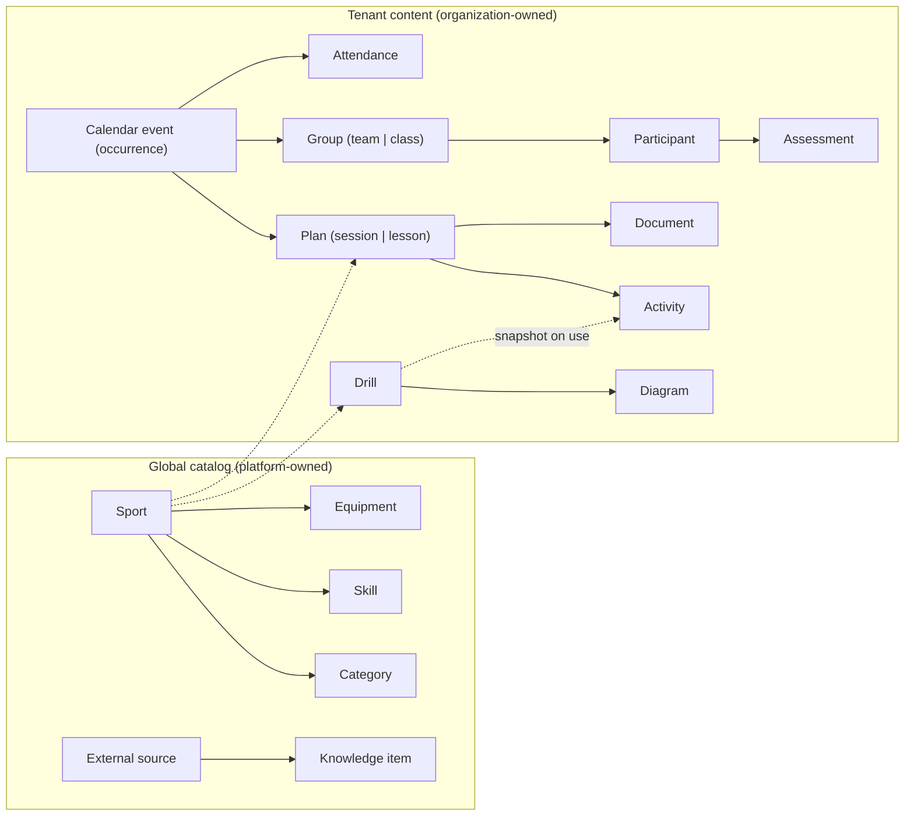
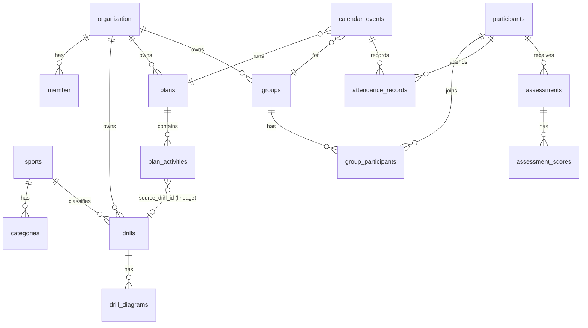

# CoachOS — Architecture

> **Status:** Proposal v1 — awaiting approval before any application code is written.
> **Date:** 2026-09-20 · **Repo state:** fresh `create-next-app` scaffold, one commit.
> **How to read this:** §0 is the whole document in two pages. §1–25 follow the requested outline. Every significant choice has a **Why** line. Anything I could not verify is marked **⚠ Verify**.

---

## 0. Executive summary

**What we are building.** An operating system for coaches and PE teachers: plan (drills → sessions/lessons), deliver (attendance, calendar), document (professional exports), and improve (assessments, AI) — starting with basketball, built multi-sport from day one.

**The architecture in one paragraph.** A **modular monolith** in one Next.js 16 app (App Router, Node runtime), PostgreSQL as the single source of truth, and three pure-TypeScript engines that hold the product's real IP and know nothing about Next or the database: the **diagram engine** (JSON → SVG), the **document engine** (plan → one document model → HTML/PDF/DOCX/XLSX), and the **sport modules** (behavior as code, taxonomy as data). Every user gets a **personal organization**, so *all* tenant data has an `organization_id` from day one and solo coaches, schools and academies are the same model. Isolation is enforced in **three layers** (typed actor context in the data-access layer → central `can()` policy → PostgreSQL row-level security), because "users must only see their own data" is a hard requirement, not a feature.

**Ten decisions that shape everything** (each justified in the section noted):

| # | Decision | § |
|---|---|---|
| D1 | Modular monolith; no microservices, no monorepo tooling yet. One exception later: a small PDF-render worker. | 3, 21 |
| D2 | PostgreSQL (Neon) + Drizzle ORM. UUIDv7 keys, `timestamptz`, soft delete, `version` column on editable rows. | 4 |
| D3 | Every user has a **personal org**; all tenant rows carry `organization_id NOT NULL`. Platform-curated content lives in a reserved **platform org**. | 7 |
| D4 | Auth = **Better Auth** (self-hosted, our DB) behind our own façade. Authorization = **our own `can()`** — not the auth library's. | 5, 6 |
| D5 | Data isolation in 3 layers incl. **Postgres RLS**, with a CI guard that fails if any tenant table lacks it. | 6, 7, 19 |
| D6 | Sport = **code module** (court geometry, diagram vocabulary, behavior) + **DB taxonomy** (categories, skills, equipment). | 8 |
| D7 | Diagram = **versioned JSON → pure resolver → SVG**. No canvas library, no AI images. Named court anchors (`"top_key"`) so humans *and LLMs* can author it. | 10 |
| D8 | **Sessions and lesson plans share one `plans` model** (discriminated by `type`) and one activity model → one builder, one export pipeline. | 11, 12 |
| D9 | **One HTML/CSS print template** drives preview, print, PDF (headless Chromium) and PNG. DOCX/XLSX come from the same *document model* via native libraries. | 13 |
| D10 | AI is **server-only, structured-output, validated, metered, draft-only**. The model never sees more than the acting user may see, and minors' data is pseudonymized by default. | 14 |

**Two findings from reading the (newer-than-my-training) Next.js 16 docs that changed my recommendation:**

1. **Nonce-based CSP requires fully dynamic rendering and is incompatible with Cache Components/PPR** ([`content-security-policy.md`](node_modules/next/dist/docs/01-app/02-guides/content-security-policy.md), "Static vs Dynamic Rendering with CSP"). CoachOS is an authenticated, per-user app that will hold data about children. **I choose strict CSP over PPR: `cacheComponents` stays off.** We lose little (nearly every page is dynamic anyway) and can revisit if SRI-based CSP leaves experimental.
2. The docs recommend a **Data Access Layer with DTOs** for new projects, warn against auth checks in layouts (layouts don't re-render on navigation), and say **Proxy must only do optimistic checks**. The authorization design in §6 follows this exactly.

**Proposed deviations from your roadmap** (details in §23): split Phase 2 into three shippable slices (drills → diagram engine → diagram editor) and add a *second-sport spike* so the multi-sport abstraction is proven before it hardens; move the basic calendar into Phase 6 with attendance; define an **Alpha** (after Phase 3) and **MVP** (after Phase 5) so real coaches can test early.

**Not doing (yet), deliberately:** microservices, Kubernetes, GraphQL/tRPC, Redis, Elasticsearch, Kafka, a monorepo toolchain, CRDT real-time collaboration, a native mobile app, a CMS. §25 lists when each would be reconsidered.

---

## 1. Product architecture

### 1.1 Personas and jobs-to-be-done

| Persona | Primary job | Primary artifacts |
|---|---|---|
| **Club/academy coach** | Plan and run training for a team over a season | Sessions, drills, attendance, player development |
| **PE teacher** | Plan and document lessons for classes, aligned to curriculum | Lesson plans, classes, assessments, reflection |
| **Assistant coach** | Execute a plan someone else made | Read plans, take attendance |
| **Organization admin** | Standardize and share across coaches/teachers | Shared library, members, branding |
| **Platform admin (us)** | Curate content, operate the platform | Catalog, sources, usage, support |

A user's *profession* (coach / PE teacher / both) drives **UX personalization** (default dashboard, terminology "players" vs "students", which builders to promote). It is **not** a permission. Permissions come from organization membership role (§6).

### 1.2 Domain model in one picture



Six ideas the whole product hangs on:

1. **Generic core, sport-specific modules.** "Drill", "Plan", "Group", "Attendance" know nothing about basketball.
2. **Plan ≠ Occurrence.** A *plan* is reusable; an *occurrence* (calendar event) is "Tuesday 17:30 with U16 Boys", with its own attendance, actual timings and reflection. This is what makes "duplicate session", "reuse this lesson for 3 classes" and "what we did last week" correct rather than hacked.
3. **Snapshot on use.** When a drill is added to a plan, the activity gets an independent copy (with `source_drill_id` for lineage). Editing the library later never silently rewrites a session a coach already printed or delivered. Coaches customize per session anyway.
4. **Structured over rendered.** Diagrams, documents and AI output are structured data; images/PDFs are *derived views*.
5. **Real or absent.** A module's navigation, widgets and buttons exist only when the feature works (§23, Phase 1).
6. **Players are children.** Participant data is the most sensitive data we hold; it drives retention, AI, and logging rules (§19.6).

### 1.3 Capability map (what lives where)

| Capability | Module | Phase |
|---|---|---|
| Accounts, profile, sessions, security | `identity` | 1 |
| Organizations, membership, roles | `organizations` | 1 (personal org) / 10 (multi-member) |
| Sports registry & taxonomy | `sports` + `src/sports/*` | 2 |
| Drill library | `drills` | 2 |
| Diagrams | `engines/diagram` | 2 |
| Sessions & lesson plans | `plans` | 3, 4 |
| Exports & documents | `engines/document`, `documents` | 5 (print view in 3) |
| Groups, participants, attendance, calendar | `groups`, `participants`, `attendance`, `calendar` | 6 |
| Assessments & development | `assessments` | 7 |
| AI | `ai` | 8 |
| Knowledge hub | `knowledge` | 2 (links) → 8 (RAG) |
| Entitlements & billing | `billing` | first gate → 11 |
| Admin | `(admin)` routes | minimal 2 → 12 |

---

## 2. Frontend architecture

### 2.1 Rendering model

- **Server Components by default.** Pages read through the DAL (§3) directly — never by calling our own HTTP API.
- **Client islands only where interaction demands it:** session builder, diagram editor, drill search, drag-and-drop, charts.
- **Mutations = Server Actions** (§18). Client-side data fetching (search-as-you-type, autosave) uses **Route Handlers + TanStack Query**, because the docs are explicit that Server Actions dispatch **sequentially per client** and must not be used for parallel/read traffic.
- **Everything Node runtime.** In Next 16, Proxy runs on Node too — no Edge split to reason about.
- `cacheComponents` **off** (see §0, §19.5). Catalog reads are cheap indexed queries; add caching where measured.

### 2.2 Design system ("CoachOS UI")

Not a template. Tailwind 4 (already installed, CSS-first `@theme`) + **Radix primitives** for accessible behavior (dialog, menu, tabs, tooltip, select), styled with our own tokens via `class-variance-authority`. We own the component code (shadcn-*pattern*, not shadcn's look).

**Token architecture** (CSS variables → Tailwind `@theme`):

- *Semantic tokens only in components:* `surface`, `surface-raised`, `ink`, `ink-muted`, `line`, `accent`, `accent-ink`, `danger`, `warning`, `success`, focus ring. Never raw hexes.
- **Theme** via `data-theme="light|dark"` + `prefers-color-scheme` default + a user preference cookie read on the server (no flash — see Next's *preventing-flash-before-hydration* guide). No `next-themes` dependency needed.
- **Per-sport accent:** `data-sport="basketball"` on the workspace shell swaps `--accent`. Each sport workspace feels distinct with zero component changes.

**Proposed visual identity — "Playbook"** *(direction only; approved at a Phase 1 design checkpoint on real screens, not in the abstract)*:

- **Metaphor:** the coach's clipboard and the court. Light mode = warm paper with ink type and hairline "court-line" rules; dark mode = arena-at-night. Court-line geometry (arcs, corners, key rectangles) as *sparing* structural ornament — dividers, empty-state art, focus states.
- **Type:** Geist for UI (already installed) + a condensed display face for headings and **tabular scoreboard numerals** for durations, counts and timers (`font-variant-numeric: tabular-nums`). Candidate: Barlow Condensed; final at the checkpoint.
- **Signature details:** numbered section markers (`01 —`) that also appear in printed documents, so screen and paper share one visual language; a time-budget bar in the session builder that behaves like a game clock.
- **Note:** the scaffold's `body { font-family: Arial }` currently overrides Geist — we replace `globals.css` wholesale.

### 2.3 Layout and responsiveness

- **Desktop:** left rail (global areas + sport workspaces), top bar (search, quick-create, notifications, user menu), content.
- **Tablet is the coach-on-court device.** Touch targets ≥ 44 px, builder and diagram editor fully usable by touch (pointer events, dnd-kit touch sensor with long-press).
- **Mobile:** rail becomes a bottom tab bar; builders degrade to single-column with sheets. Attendance and "view today's session" are first-class on mobile (Phase 6).
- **Sport workspace = scoped lens over generic modules.** `/sports/basketball/sessions` is the same list component as `/sessions` with `sport=basketball`, plus sport-only extras (Knowledge Hub, AI coach). Not a copy of the code.

### 2.4 State, forms, states

| Concern | Approach | Why |
|---|---|---|
| Server state | RSC + DAL; TanStack Query only for client-driven fetches (Phase 2+) | Less client JS; matches Next 16 guidance |
| Forms | `<form action>` + Server Action + `useActionState` + Zod; `useOptimistic` where it earns its keep | Progressive enhancement, one validation source. No `react-hook-form` until a builder needs it |
| Builder state | Reducer + command stack (undo/redo), autosave with `version` check | Predictable, testable without React |
| Diagram editor state | Same command pattern, pure reducer in `engines/diagram/editor` | Testable headless |
| Route feedback | `loading.tsx` / `error.tsx` per segment, `global-error.tsx`, `not-found.tsx` | Required by Next's production checklist |
| Empty states | One `EmptyState` component; every empty state has a *working* next action | No dead ends |
| Motion | CSS transitions + React/Next View Transitions; respects `prefers-reduced-motion` | Smooth without a motion library |

### 2.5 Accessibility, i18n, units

- **WCAG 2.2 AA** target. Radix for focus management; `eslint-plugin-jsx-a11y` (ships with `eslint-config-next`); `axe` in E2E; keyboard-only journeys tested. Diagrams get auto-generated text descriptions (§10.6).
- **i18n from day one, English strings first.** `next-intl` *without* URL locale routing (the app is behind login; SEO-irrelevant); locale in user profile. CSS **logical properties** (`margin-inline-start`, not `margin-left`) so RTL is not a rewrite. Retrofitting i18n into hundreds of components is one of the most expensive refactors in SaaS; adding it up front is cheap. **Decision needed: which locales at launch (Appendix A).**
- **Units preference** (metric/imperial): court dimensions and distances render in the user's units; stored in meters.
- **Content language:** user-authored content (drills, plans) stores a `locale`; platform content is translatable through message catalogs/`*_i18n` rows.

---

## 3. Backend architecture

### 3.1 Shape: modular monolith

One deployable. Vertical feature modules with enforced boundaries; pure engines below them. **Why:** a small team shipping a product with heavy shared domain logic (plans, activities, documents, diagrams) gets nothing from network boundaries except latency and operational cost. The module boundaries give us the *option* to extract later (the export worker in Phase 5 is the first candidate and needs no shared code — §13.4).

### 3.2 Layers (per module)

```
app/… (pages, actions, route handlers)   ← thin: parse → call → shape response
   │
modules/<domain>/
   ├─ queries.ts    server-only. READ. Takes Actor. Returns DTOs. Never returns raw rows.
   ├─ commands.ts   server-only. WRITE. authorize → validate → transaction → audit → (outbox).
   ├─ schema.ts     Drizzle tables (+ RLS policies)
   ├─ validators.ts Zod schemas (shared with client forms and AI structured output)
   ├─ dto.ts        Public shapes + mappers (what may cross to the client)
   └─ index.ts      The ONLY import surface for other modules
   │
engines/*  (pure TS: no Next, no DB, no fetch)      lib/* (db, authz, storage, mail, logger, env)
```

**Why CQS-lite (`queries`/`commands`) instead of a generic repository:** it makes the security-relevant question — *"which functions can mutate tenant data?"* — greppable, and it is exactly the DAL pattern the Next docs recommend. Every exported function takes an `Actor` as its first parameter; there is no way to call the DAL "anonymously."

### 3.3 Request pipeline (every mutation)

```
Server Action / Route Handler
 1. requireActor()            → authenticated session + active org + membership (cached per request)
 2. parse & validate (Zod)    → never trust FormData/JSON/params
 3. can(actor, action, res?)  → central policy (§6) — includes entitlements later
 4. db.tenantTx(actor, tx =>  → opens tx, sets app.user_id / app.org_id for RLS
      do work + write audit event in the SAME transaction )
 5. side effects              → `after()` for non-critical; outbox row for must-not-lose (later)
 6. return Result<T>          → typed {ok, data} | {ok:false, error:{code, fields?}}
```

### 3.4 Errors, logging, idempotency

- **Typed errors** (`UNAUTHENTICATED, FORBIDDEN, NOT_FOUND, VALIDATION, CONFLICT, RATE_LIMITED, ENTITLEMENT_EXCEEDED, INTERNAL`) mapped to HTTP problem responses (RFC 9457) and to action results. Expected failures are *returned*, not thrown. Cross-tenant access returns `NOT_FOUND`, not `FORBIDDEN` (no existence oracle).
- **Logging:** `pino` JSON with `requestId`, `orgId`, `userId`; redaction list (passwords, tokens, participant names, note bodies). **Rule: never log participant PII or free-text notes.**
- **Idempotency keys** on POSTs that create expensive or duplicate-prone things (exports, AI generations, imports).
- **Optimistic concurrency:** `version` column; updates `WHERE id=? AND version=?`; conflict → `CONFLICT` with the current version. Autosave sends `If-Match`.

### 3.5 Background work

- **Now → Phase 4:** none needed. Do not add a queue speculatively.
- **`after()`** (Next) for non-critical post-response work (analytics, best-effort emails).
- **When first needed** (Phase 5 exports at scale / Phase 8 long AI runs / notifications): **`pg-boss`** — a Postgres-backed queue, no new vendor, transactional enqueue — consumed by the same long-running worker service that hosts the export renderer. Revisit Inngest/Trigger.dev only if we outgrow it.
- **Outbox pattern** (a `outbox` table written in the command's transaction) for side effects that must not be lost (email, notifications). Introduced with the first such effect.

### 3.6 Config and secrets

`src/lib/env.ts` validates all environment variables with Zod at boot (fail fast). **Only `lib/*` reads `process.env`** (Next's data-security guidance). `NEXT_PUBLIC_*` is an allowlist reviewed in PRs. `NEXT_SERVER_ACTIONS_ENCRYPTION_KEY` set explicitly in every deployed environment (multi-instance safety).

---

## 4. Database architecture

### 4.1 Choices

| Choice | Decision | Why |
|---|---|---|
| Engine | **PostgreSQL** | Relational integrity, RLS, `jsonb`, full-text search, `pg_trgm`, `pgvector` later — one engine for everything we need for years |
| Host | **Neon** (serverless Postgres) | Branching (per-PR preview DBs, dev branches), PITR, pooled endpoint, EU/US regions, no Docker needed on your Windows machine, free tier for dev |
| ORM | **Drizzle** (+ `drizzle-kit` migrations) | SQL-first, typed, tiny runtime, first-class Postgres RLS/policy support, Better Auth adapter. Chosen over Prisma because RLS + transaction-scoped `set_config` are central to our isolation model and are awkward in Prisma |
| Driver | `pg` Pool via Neon **pooled** connection string | RLS needs interactive transactions (`set_config(…, true)`), which Neon's HTTP driver can't do. One-file swap (`lib/db/client.ts`) to `@neondatabase/serverless` if connection churn appears |
| IDs | **UUIDv7** generated in-app | Time-ordered (index locality), non-enumerable (defense in depth vs IDOR), and **client-generatable → offline-capable later** |
| Time | `timestamptz` UTC; IANA timezone stored on events and profile | Correct DST/recurrence behavior |
| Deletes | `deleted_at` on user-authored content; hard-delete via retention/erasure job | Recoverability + GDPR erasure |
| Concurrency | `version int` on editable rows | Autosave/multi-device correctness |
| Ordering | **Fractional indexing** (`position text`) for sortable lists | Drag-reorder = 1 row update; merge-friendly for future offline |
| Migrations | Forward-only, expand/contract, run in CI/CD **before** promote, never on app boot | Safe rollbacks |
| Roles | `coachos_owner` (migrations, owns tables) ≠ `coachos_app` (runtime, `NOBYPASSRLS`, DML only) | RLS is meaningless if the app connects as the table owner |

**Rejected:** Supabase (great, but bundling DB+auth+storage+RLS-by-JWT would couple our authorization model to a vendor); MongoDB (our data is relational); Prisma (see above).

### 4.2 Table families and ownership

| Family | Tables | Scoped by | Phase |
|---|---|---|---|
| **Auth (managed by Better Auth)** | `user`, `session`, `account`, `verification` | global; **no RLS**, accessed only via `modules/identity` | 1 |
| **Org** | `organization`, `member`, `invitation`, `organization_branding` | org | 1 / 10 |
| **Profile** | `profiles` (1:1 user: profession, locale, timezone, units, onboarding state) | user | 1 |
| **Files** | `files` | org | 1 |
| **Audit** | `audit_events` (append-only) | org | 1 |
| **Catalog (global)** | `sports`, `categories`, `skills`, `equipment_types`, `age_groups`, `external_sources`, `knowledge_items` | none (platform) | 2 |
| **Drills** | `drills`, `drill_diagrams`, `favorites`, `recent_items` | org | 2 |
| **Plans** | `plans`, `plan_objectives`, `plan_activities` (+ view `plan_totals`) | org | 2–4 |
| **People** | `groups`, `group_members`, `participants`, `group_participants` | org | 6 |
| **Time** | `calendar_events` (+ exceptions), `attendance_records` | org | 6 |
| **Development** | `assessment_templates`, `assessments`, `assessment_scores` | org | 7 |
| **Documents** | `documents`, `document_templates`, `share_links` | org | 5 |
| **AI** | `ai_requests`, `coach_preferences` | org | 8 |
| **Platform ops** | `notifications`, `outbox`, `feature_flags` | user/org | as needed |
| **Commerce** | `plans_catalog`, `plan_entitlements`, `subscriptions`, `usage_counters`, `billing_customers` | org | 11 (seam earlier) |

> Naming note: the *product* says "session" and "lesson plan"; the DB table is `plans` (type-discriminated) — see D8, §11. Your brief lists `Sessions / SessionActivities / LessonPlans` separately; I recommend merging them and have flagged it because it is a deliberate departure. It is free to reverse before Phase 3 (no data exists).

### 4.3 Core relationships (Phases 2–6)



### 4.4 JSON columns: where and how

`jsonb` for **document-shaped, versioned content that is never filtered on relationally**: `drills.content` (setup, instructions, coaching points…), `drill_diagrams.data`, `plan_activities.content`, `plans.details`. Facets that users **filter/sort by** (sport, category, age range, level, player range, duration) are **real, indexed columns**. Every JSON column has a Zod schema **and** a `schemaVersion`; reads pass through a `migrate()` so old rows keep working. **Why:** relational where we query, document where we render — no EAV, no 60-column tables.

### 4.5 Search

Postgres **full-text search** (generated `tsvector` with `unaccent`) + `pg_trgm` for typo tolerance, from Phase 2. `pgvector` for semantic drill retrieval when the AI phase needs it (Phase 8). No Elasticsearch/Algolia/Typesense until measurement says Postgres can't.

### 4.6 Backups and residency

Neon PITR + a scheduled logical dump to object storage, with a **documented restore drill** (an untested backup is a hope). Region is a launch decision (EU vs US — Appendix A); schools and EU academies will ask.

---

## 5. Authentication architecture

### 5.1 Choice: Better Auth (self-hosted)

| Option | Verdict |
|---|---|
| **Better Auth 1.7.x** | **Chosen.** Runs in our app against our Postgres; first-party `organization` plugin (orgs, members, invitations, roles); also `two-factor`, `admin`, `haveibeenpwned`, `email-otp`, `magic-link`, `generic-oauth` plugins; Drizzle adapter; declares Next 14/15/16 + React 18/19 + `drizzle-orm ^0.45.2` peers (**verified via `npm view`, 2026-09-20**) |
| Clerk / Auth0 / WorkOS | Excellent DX, but per-MAU cost, user data in a vendor (harder for school DPAs), and org models we'd bend around. Kept as the escape route if we ever need enterprise SSO faster than we can build it |
| Auth.js | Weaker first-class multi-tenant/org story; we'd build the tenancy model ourselves |
| Hand-rolled (`jose` + cookies, per the Next auth guide) | Educational, but we'd own password reset, email verification, rate limiting, session revocation, and OAuth flows — the exact surface where homegrown auth gets breached |

**Risk (honest):** Better Auth is young and moves fast. **Mitigations:** pin the exact version; **all Better Auth imports live in `modules/identity`** (a façade); it only answers *"who is this and which org are they acting in?"* — authorization is ours (§6); contract tests around the façade.

### 5.2 Phase 1 capabilities

- Email + password. **Min 12 chars, max 128, no composition rules, breached-password check** (`haveibeenpwned` plugin — NIST 800-63B direction). Hashing: Better Auth's default (scrypt) is acceptable per OWASP; upgrade to Argon2id only if a compliance reviewer asks.
- **Email verification required** before using the app. Password reset by emailed one-time link (short TTL, single use, invalidates other sessions).
- **Sessions:** DB-backed, `HttpOnly`, `Secure`, `SameSite=Lax`, sliding 7-day expiry, "fresh session" requirement for sensitive changes (password/email/delete). Short-lived signed cookie cache for performance (revocation lag ≤ cache TTL, accepted and documented). **Users can list and revoke their own sessions** in Settings → Security.
- **Rate limiting** on auth endpoints (Better Auth built-in, DB storage — no Redis).
- **Account deletion** with password re-auth; removes user, personal org, files.
- Sign-out everywhere; audit events for sign-in, failed lockouts, password/email change, session revoke.

### 5.3 Designed-for, built later

Google/Microsoft sign-in (fast follow — schools live in Workspace/M365), **2FA/passkeys** (mandatory for org admins and super-admins, Phase 10), **SAML/OIDC SSO** for schools (Phase 10, likely via `generic-oauth`/WorkOS), API keys for the public API (Phase 12).

### 5.4 Where authentication is checked

| Layer | Role | Note |
|---|---|---|
| `proxy.ts` | **Optimistic only:** redirect if no session cookie; set CSP nonce & security headers | Per docs, Proxy runs on prefetches and "should not be your only line of defense" |
| `requireActor()` in DAL/actions/route handlers | **The real check** (DB-backed) | `React.cache()`-memoized per request |
| Layouts | **No auth decisions** | Docs: layouts don't re-render on navigation |

Mail: **Resend** (simple API; React-based templates possible later). Dev transport logs the email to the console so flows are testable without an account; production requires a verified domain with SPF/DKIM/DMARC.

---

## 6. Authorization architecture

### 6.1 Three separate concepts (the brief mixes them; the design must not)

| Concept | Stored on | Examples | Purpose |
|---|---|---|---|
| **Platform role** | `user.role` | `user`, `super_admin` | Operating CoachOS itself |
| **Membership role** | `member.role` (per org) | `owner`, `admin`, `coach`, `teacher`, `assistant` | What you may do *in an organization* |
| **Profession** | `profiles.profession` | `coach`, `pe_teacher`, `both` | UX personalization only |

### 6.2 The four checks

```
proxy.ts (optimistic)  →  requireActor()  →  can(actor, action, resource)  →  DAL scoping  →  RLS
      cookie present         session+org+role     central policy               org_id filter     database backstop
```

**`can()`** is a single, pure, table-driven module (`lib/authz`): `can(actor, "drill:update", drillRecord) → boolean`.
- Actions are `resource:verb` strings in one typed registry.
- A role→permission matrix (data, not `if` chains) plus **resource conditions** (creator-only edits, visibility, assistant scoped to assigned groups).
- Later, **entitlements** (§17) are a second gate inside the same call: *"role allows it"* AND *"plan allows it."*
- Pure → exhaustively unit-tested as a table (role × action × resource state).

**Sample matrix (Phase 2–3 subset):**

| Action | owner | admin | coach | teacher | assistant |
|---|:-:|:-:|:-:|:-:|:-:|
| `drill:read` (own org + public) | ✓ | ✓ | ✓ | ✓ | ✓ |
| `drill:create` | ✓ | ✓ | ✓ | ✓ | — |
| `drill:update` (own) / (any in org) | ✓/✓ | ✓/✓ | ✓/— | ✓/— | —/— |
| `plan:create` / `plan:update` (own) | ✓ | ✓ | ✓ | ✓ | —/— |
| `plan:read` | ✓ | ✓ | ✓ | ✓ | ✓ (assigned groups) |
| `member:invite`, `org:update` | ✓ | ✓ | — | — | — |
| `org:delete`, `billing:manage` | ✓ | — | — | — | — |

### 6.3 Rules that prevent the classic bugs

1. **Ownership comes from the session, never the client.** Actions take *a reference plus the change* — never a whole object with an `organizationId`. (The Next docs' `completeItemUnsafe` vs `completeItem` example is our code-review checklist.)
2. **Every Server Action re-authorizes.** Rendering a button only for admins is UX, not security.
3. **Cross-tenant = `NOT_FOUND`.**
4. **Super-admin is not a bypass of tenancy.** Support access to a tenant's data is explicit, time-boxed, audited, and visible to the tenant ("break-glass"), implemented in a separate admin DAL.
5. **Destructive actions** (delete org, delete account, transfer ownership) require a fresh session.

---

## 7. Multi-tenant organization architecture

### 7.1 Model

**Shared database, shared schema, `organization_id` on every tenant row.** Cheapest to operate, straightforward to test, and it does not prevent moving a very large tenant to its own database later, because *every* row already carries its tenant key and every index leads with it.

**Every user has a personal organization** (`type = 'personal'`), created transactionally at sign-up. There is no "user-owned vs org-owned" fork anywhere in the schema:

| Org `type` | Purpose |
|---|---|
| `personal` | A solo coach's or teacher's workspace (auto-created) |
| `club` / `academy` / `school` / `company` | Multi-member organizations (Phase 10) |
| `platform` | One reserved org owning **curated** content (system drills, templates) |

**Why (the key decision):** the alternative — a nullable `organization_id` plus `owner_user_id` with an XOR check — infects every query, every RLS policy and every permission check with a two-way branch, and makes "a solo coach becomes a club" a data migration. With personal orgs it is: create/upgrade an org, invite members.

### 7.2 Membership, active org, switching

A user can belong to several orgs (a PE teacher: personal workspace + their school). The **active org** lives in the session; the shell shows an org switcher once a user has ≥ 2 orgs. All reads and writes are scoped to the active org.

### 7.3 Sharing: visibility + copy, never cross-tenant references

`visibility ∈ { private | organization | public }`

- `private` — creator only (within the org)
- `organization` — all members (subject to role)
- `public` — readable by all authenticated users; **only platform-org rows may be `public`** at first

**Cross-org sharing is by copy ("fork")** with `forked_from_id` lineage. A teacher moving to a new school takes copies of their drills; a school shares a template by publishing a copy. **Why:** there is no cross-tenant read path to secure, audit, or leak, and a future marketplace is just "public forks."

### 7.4 Reading public/platform content

RLS `SELECT` policy: `organization_id = current_org OR (visibility = 'public' AND status = 'published')`. `UPDATE/DELETE`: own org only. The platform org is authored by super-admins through the normal drill editor (dogfooding) and seeded from reviewed JSON files in git for reproducibility across environments.

### 7.5 Lifecycle and scale

Tenant export and tenant deletion are first-class (GDPR, school offboarding). Per-org quotas via entitlements prevent noisy neighbors. Composite indexes always start with `organization_id`. An org that outgrows shared infrastructure can be exported into a dedicated database without a schema change.

---

## 8. Sports architecture

### 8.1 Split: behavior in code, taxonomy in data

| Lives in **code** (`src/sports/<key>/`) | Lives in **database** (`sports`, `categories`, `skills`, …) |
|---|---|
| Court/pitch geometry, diagram vocabulary (entities, actions, styles, anchors) | Drill categories and their hierarchy |
| Sport-specific facets and validators | Skills, equipment types, age-group labels |
| Terminology keys, defaults (session length, positions) | Assessment criteria templates |
| Which external sources apply | Sport status (`active | beta | planned`) → drives navigation |

**Why the split:** geometry, renderers and validators are *code* and must be type-checked and tested. Categories/skills/equipment are *content* that admins refine, that orgs may extend, and that translate. Putting taxonomy in code makes every wording fix a deploy; putting geometry in the DB makes it untestable.

### 8.2 The `SportModule` contract

```ts
export interface SportModule {
  key: SportKey;                       // "basketball" — matches sports.key
  diagram: DiagramPack;                // §10: court geometry, anchors, entity+action vocab, styles
  facets: FacetDefinition[];           // sport-specific drill/plan facets (space, court type…)
  defaults: { sessionMinutes: number; positions: Position[]; };
  terminology: MessageNamespace;       // next-intl namespace ("players" vs "swimmers")
  assessmentDefaults?: AssessmentTemplateSeed[];
  knowledgeSources?: string[];         // external_sources.key
}
```

`registry.ts` maps keys → modules; **the URL segment `[sport]` is validated against the registry** (404 otherwise). No `if (sport === "basketball")` outside `src/sports/basketball`.

### 8.3 Proving the abstraction

The brief's biggest architectural risk is a "multi-sport" system that is really a basketball system with a `sport` column. **Mitigation: at the end of Phase 2, a time-boxed spike renders one football (soccer) pitch diagram through the same engine, with zero engine changes.** If the spike needs engine changes, we fix the abstraction while only one sport exists. Swimming (lanes, no ball) is the second stress test in Phase 9.

### 8.4 Adding a sport (target: days, not weeks)

1. `src/sports/<key>/` implementing `SportModule` (court pack + facets + terminology).
2. Seed taxonomy (categories, skills, equipment) as reviewed JSON.
3. Flip `sports.status` to `active`. Navigation, filters and builders pick it up.

---

## 9. Drill architecture

### 9.1 Shape

**Filterable facets = columns; long-form content = validated JSON** (§4.4).

| Group | Fields |
|---|---|
| Identity | `id`, `organization_id`, `sport_id`, `title`, `slug?`, `locale`, `visibility`, `status (draft|published|archived)`, `created_by`, `version`, `forked_from_id?` |
| Classification (columns, indexed) | `category_id`, `age_min`, `age_max`, `level`, `players_min`, `players_max`, `duration_min`, `duration_max`, `space` (sport facet), tags (`text[]`), `skills` (link) |
| `content` (jsonb, versioned) | `objective`, `setup`, `instructions[]`, `coachingPoints[]`, `commonMistakes[]`, `safety`, `progressions[]`, `regressions[]`, `variations[]`, `equipment[]`, `videoLinks[]` |
| Diagrams | `drill_diagrams(drill_id, position, title, schema_version, data)` — a drill can have several (setup, progression 1…) |

**Design details that pay off later**
- **Age is a range in years + display labels**, not "U16". "U16", "Cadet", "Grade 7" are locale/country presentations of the same range.
- **Equipment is structured:** `{ type: "basketball", rule: "per_pair" | "per_player" | "fixed", qty }`. This lets the session builder aggregate equipment and lets AI/validators check *"14 players, 7 balls → pairs OK."*
- **Video is link-only** to allowlisted providers (YouTube/Vimeo), rendered click-to-load with privacy-enhanced embeds; we never server-fetch user-supplied URLs (SSRF).
- **Favorites / recents** are small tables (`favorites`, `recent_items`) that power dashboard widgets with real data.
- **Sources of drills:** platform-curated (public), organization-owned, personal (personal org), forked. Provenance is always visible.

### 9.2 Content pipeline (a non-code risk worth naming)

The curated basketball library is **content, not code**, and content quality is what coaches will judge us on. Rules: original text only (no copying from books/sites — generic techniques are fair game, expressed in our own words), reviewed by a qualified basketball coach, stored as Zod-validated JSON seeds in git, applied by an idempotent seed script keyed by stable `seed_key`. **Appendix A asks who authors/reviews the first ~40–60 drills.**

---

## 10. Professional diagram engine architecture

### 10.1 Pipeline

```
Drill/Plan data → Diagram JSON (validated) → Resolver (pure geometry) → SVG renderer (React, SSR-safe)
                                                                    ├─ screen (interactive)
                                                                    ├─ print (vector, in PDF via Chromium)
                                                                    └─ PNG / embedded raster (resvg) for DOCX/XLSX
```

### 10.2 Why SVG (and not Canvas / a canvas library / AI images)

| Requirement | SVG | Canvas / Konva / Fabric |
|---|---|---|
| Print/PDF quality | Vector, crisp at any size | Raster |
| Server rendering for export & tests | `renderToStaticMarkup` | Needs headless canvas |
| Accessibility | Real DOM, `<title>/<desc>`, focusable | Opaque pixels |
| Golden-file testing | Deterministic text snapshots | Pixel diffs |
| Editor interaction | Pointer events on elements | Library-owned scene graph |
| Bundle/dependency | **Zero dependency** | Dependency + lock-in |

AI-generated images are excluded as the primary mechanism (as you specified): they are inaccurate, un-editable, un-versionable, and can't be validated.

### 10.3 Data model (schema v1)

Your brief sketched `players[]`, `balls[]`, `cones[]`, `arrows[]`, `actions[]`. I recommend **normalizing** to typed, id'd `entities` and `actions`: one list to select/z-order/undo/diff/validate, and a discriminated-union schema an LLM can be constrained to.

```json
{
  "schemaVersion": 1,
  "sport": "basketball",
  "court": { "type": "half", "variant": "fiba" },
  "entities": [
    { "id": "o1", "type": "player", "side": "offense", "label": "1", "at": { "anchor": "top_key" } },
    { "id": "o2", "type": "player", "side": "offense", "label": "2", "at": { "anchor": "left_wing" } },
    { "id": "x1", "type": "player", "side": "defense", "label": "X1", "at": { "anchor": "top_key", "offset": [0, 1.2] } },
    { "id": "b1", "type": "ball", "heldBy": "o1" },
    { "id": "c1", "type": "cone", "at": { "x": 3.2, "y": -1.0 } }
  ],
  "actions": [
    { "id": "a1", "step": 1, "type": "pass",   "from": "o1", "to": "o2" },
    { "id": "a2", "step": 2, "type": "cut",    "entity": "o1", "path": [{ "anchor": "elbow_left" }, { "anchor": "low_block_right" }] },
    { "id": "a3", "step": 2, "type": "screen", "entity": "o3", "target": { "entity": "x2" } }
  ],
  "annotations": [
    { "type": "zone", "shape": "rect", "from": { "anchor": "left_wing" }, "to": { "anchor": "left_corner" }, "label": "Help side" },
    { "type": "text", "at": { "x": 0, "y": 5 }, "text": "Read the closeout" }
  ]
}
```

Key properties:

- **Positions accept three forms:** absolute `{x,y}` in **meters**, a **named court anchor** (`top_key`, `left_wing`, `low_block_right`, `free_throw_line`…), or **anchor + offset** / **relative to an entity**. Named anchors are how the JSON stays human-readable *and* how an LLM produces accurate diagrams — models are poor at precise coordinates and good at semantics. The court pack owns the anchor dictionary.
- **Steps:** `action.step` (default 1). An entity's position at step *n* is derived from the movement actions (`cut`, `dribble`, `rotation`) before it; a `pass` re-parents the ball. Print renders all steps overlaid with numbered arrows; the screen viewer can step through; animation is a later renderer over the same data.
- **Action vocabulary** (sport-defined; basketball v1): `pass`, `dribble`, `cut`, `screen`, `shot`, `handoff`, `rotation`, `closeout`. Line style follows standard coaching-diagram conventions (pass = dashed arrow, cut = solid arrow, dribble = wavy line, screen = line ending in a T-bar).
- **Court variants:** geometry lives in data in the sport's court pack (FIBA first; NBA/NCAA/mini-basketball later). **⚠ Verify:** the FIBA dimensions (28×15 m court, 6.75 m three-point radius, 4.9 m lane, 1.25 m restricted-area arc, etc.) are transcribed from the current *FIBA Official Basketball Rules* at implementation time and cited in the pack's `source` metadata — I am not asserting them from memory.

### 10.4 Modules

```
src/engines/diagram/
  schema/    Zod schema, JSON-Schema export (feeds AI structured output), version migrations
  core/      geometry, anchor/offset resolution, step resolution, path/arrowhead routing,
             label placement, semantic validators (in bounds, refs exist, one ball holder…)
  render/    <DiagramView> (pure SVG React), themes (screen | print | mono), svgToString, png
  editor/    (Phase 2c) reducer + commands + tools + snapping + undo/redo + keyboard
src/sports/basketball/diagram/   court-fiba.ts, anchors.ts, entities.ts, actions.ts, styles.ts
```

Dependency direction: **`sports/*` → `engines/diagram` (interface)**, never the reverse. The engine has no idea basketball exists.

### 10.5 Editor (Phase 2c)

SVG + Pointer Events; tools: select/move, add player/ball/cone/marker, draw pass/cut/dribble/screen, label, delete, step assignment; snapping to anchors and grid; undo/redo; full keyboard operation; touch-first ergonomics. State is the same pure reducer used in headless tests.

### 10.6 Quality properties

- **Deterministic output** (stable ids, fixed numeric precision) → golden-SVG snapshot tests.
- **Property tests** (`fast-check`): every resolved point inside the court, resolver is idempotent, migration(v)→latest is total.
- **Accessible:** `describeDiagram(json)` generates alt text ("Half court. 3 offensive players, 2 defenders. Step 1: 1 passes to 2…") — used as `<desc>`, in DOCX alt text, and as an AI-readable summary.
- **Perf:** the resolver is pure and memoizable; the editor re-renders only changed entities.

---

## 11. Session builder architecture

### 11.1 Data model

**As built in Step 2 (`drizzle/0005_plans_and_age_groups.sql`).** Three tables, one view, one catalog:

- `plans` (`type = 'training_session'`): `organization_id`, `sport_id`, `title`, `status` (`draft | published | archived`), `visibility` (`private | organization` — public sharing comes later as share links, never as a visibility), `created_by`, `version`, `deleted_at` (soft delete), filterable facts as real columns (`team_name`, `age_group_id` + `age_min/max`, `level`, `players`, `target_minutes`, `objective`), scheduling as **local wall-clock time in an IANA zone** (`scheduled_date`, `start_time`, `timezone`), and everything else in versioned JSON `details` (location, season, session number, coach, club/school/academy, coach notes). `forked_from_id` keeps duplication open.
- `plan_objectives`: references into the sport's **objectives catalog** — coach-friendly umbrella names (Shooting, Ball Handling, Passing, Finishing, Footwork, Defense, Rebounding, Transition, Team Offense, Team Defense, Pick-and-Roll, Decision Making, Conditioning, Special Situations), one primary and up to four secondary, no free text. Each objective is mapped (`objective_skills`, `objective_categories`) onto the detailed skills and drill categories; a top-level skill stands for its sub-skills, so *Shooting* reaches Shooting form, Catch-and-shoot, Pull-up and Free throws. Skills and drill validation are untouched; drill matching and the generator use `drillMatchesObjective`.
- `plan_activities`: `position`, `phase` (the shared drill phases), `kind` (`drill | custom | break`), `title`, `duration_min`, `repetitions`, `players`, `notes`, `source_drill_id` + `source_drill_version` (lineage), **`snapshot`** (validated, versioned JSON copy of the drill — see below), `customized`, `change_reason`.
- `plan_totals` (view, `security_invoker`): total length and start/end instants. **Nothing derived is stored**: total = `SUM(duration_min)`, end = start + total.
- `age_groups` (global catalog, per sport): U8 … Senior with the band's typical ages.

Deliberate differences from the first sketch: `position` is a 0-based integer with a *deferrable* unique constraint (a reorder is one `UPDATE`; sessions have ≤ 60 activities, so fractional indexes buy nothing); `phase` reuses the drill phases (warm-up, skill, small-sided, game, conditioning, cool-down) instead of a second list; the snapshot column is called `snapshot` because it is a frozen copy, not live content.

**Snapshot on use.** Adding a drill copies it (`buildDrillSnapshot`) — title, description, category, skills and sub-skills, ages, players, duration, intensity, format, phases, equipment, the full drill content (organization, setup, instructions, coaching points, mistakes, safety, progressions, regressions, variations, resource links) and diagrams — plus provenance (drill id, the drill's version, when, and its licence/credit fields). Later library edits, or the drill becoming private or archived, never change a session. "Update from library" is an explicit command (`replaceActivityDrill`); the read model only *reports* `update_available` / `unavailable`.

**Security.** Row-level security on all three tables, forced. Reads: your workspace's sessions, except colleagues' private ones. Writes additionally verify real membership and an authoring role (`org_authors`) against the `member` table. Children follow the parent (`can_write_plan`); deleted and archived sessions are frozen by trigger. A drill can only be *added* if the actor can read it (checked when the link is set, so a source that becomes unreadable later never blocks editing).

### 11.2 Client architecture

```
┌──────────────┬────────────────────────────┬─────────────────┐
│ Drill library│  Timeline (sortable)       │  Inspector      │
│ search/filter│  01 Warm-up        10'     │  duration, notes│
│ preview      │  02 Passing        15'     │  coaching pts   │
│ (TanStack Q) │  …                         │  equipment      │
│              │  ▓▓▓▓▓▓▓▓▓░  75/90 min     │  diagram        │
└──────────────┴────────────────────────────┴─────────────────┘
```

- **Reducer + command stack** (`addActivity`, `moveActivity`, `setDuration`, …) → free undo/redo, trivial unit tests.
- **Drag-and-drop:** `@dnd-kit/core` + `@dnd-kit/sortable` (stable) with keyboard and touch sensors; the newer `@dnd-kit/react` (0.5.0, pre-1.0) is re-evaluated in a Phase 3 spike. Reorder = one fractional-index write.
- **Autosave:** debounced `PUT` with `If-Match: <version>`; a 409 shows a "changed elsewhere" resolution UI. A saving/saved indicator is always visible.
- **Live derived data (real, computed):** total vs target time bar, equipment rollup (max simultaneous need), player-count compatibility warnings per activity, safety-notes rollup. Warnings are soft; only structural problems block saving.
- **Duplicate activity / duplicate session** are server commands (deep copy, new IDs, `forked_from`).
- **Add drill** = snapshot copy into `content` with lineage; "Update from source" is an explicit action.
- **Custom activities** and breaks are first-class (`kind`).
- **Professional view** (Phase 3) is the print-styled HTML rendering of the document model (§13) — so "Print" works in Phase 3 via the browser, and Phase 5 adds files.
- **Share later** (Phase 5+): `share_links` — hashed token, scope, expiry, read-only.

### 11.3 As built in Step 3 (the first builder)

- **Routes:** sessions are their own area, `/sessions/[sport]` (My Sessions), `/new`, `/[id]` (the builder), `/[id]/drills[/drillId]` (add a drill) and `/[id]/replace/[activityId][/drillId]` (replace one). "Sessions" is in the main navigation; `/sessions` goes straight to the only active sport.
- **The drill selector is the library's own search**, not a second one: the same URL-driven filters, format chips, cards and pagination, pointed at a session; a result opens a preview with the add form. It is a page rather than a modal, so it works on a phone and every state is a link.
- **One queue, optimistic UI.** Every change (details, duration, reorder, add…) goes through a single client queue that presents the session's version and runs requests strictly one after another; `useOptimistic` applies the change on screen at once and the server's answer replaces it. A refusal reverts it; a `CONFLICT` shows a "changed elsewhere" banner instead of overwriting.
- **No second calculation.** Offsets, total, remaining time and end time in the browser come from the same pure functions the server and the `plan_totals` view use (`modules/plans/schedule`). The timeline labels are minutes into the session (`00:00–10:00 … 80:00–90:00`).
- **Autosave** of the details form is debounced (0.9 s), sent through the same queue, validated with the server's own schemas first, saved immediately when the tab is hidden, and always visible as Saved / Saving… / Unsaved changes / Fix the highlighted fields / Couldn't save / Changed elsewhere.
- **Reordering:** drag-and-drop with `@dnd-kit` (pointer, touch with a short press, keyboard) **and** labelled Up / Down buttons; every change is announced to screen readers.
- **Objectives** in the form are the coach-facing catalog (Shooting, Transition…); the detailed skills never appear.

---

## 12. PE lesson plan architecture

### 12.1 Same model, different `details`

A lesson plan is `plans.type = 'lesson_plan'`, using the **same activity model and phases** (warm-up / main / cool-down) and the same builder shell, with a lesson-specific `details` schema:

```
details: {
  grade, className?, studentCount, ageRange,
  topic,
  learningObjectives[], curriculumObjectives[{ framework, code?, text }], learningOutcomes[],
  space, equipment[],
  differentiation { support, core, extension },
  inclusion,
  assessment { formative[], summative[], criteria[] },
  safety,
  teacherNotes,
  reflection            // Phase 4: on the plan; moves to the occurrence in Phase 6
}
```

**Why one model:** one builder, one document pipeline, one duplication path, one calendar link, one AI generation target, and PE teachers can use *any supported sport* by construction (`sport_id` is just a column).

### 12.2 Decisions and honest caveats

- **Curriculum frameworks are country-specific** (England NC, SHAPE America, Australian Curriculum, IB, national programs…). Phase 4 ships **free-text + framework-labelled objectives**. Structured, licensed/attributed framework catalogs (using the same source-registry pattern as §15) come later and per market. **Appendix A asks which markets matter first.**
- **Reflection belongs to a delivery, not a plan.** Phase 4 stores `reflection` on the plan for simplicity; Phase 6 introduces occurrences and migrates reflection to `calendar_events`. Known, planned, small migration — flagged so it isn't a surprise.
- Class linkage: Phase 4 uses free-text grade/class + student count; Phase 6 adds an optional `group_id`.
- **Org lesson templates** (schools mandating a format) arrive with organizations (Phase 10) as parametrized document templates, not free-form HTML.

---

## 13. Export / document architecture

### 13.1 Principle: one document model, many renderers

```
Plan (DB) ──▶ buildDocumentModel(plan, template, branding, locale, units)
                        │   pure, unit-tested; "what goes on the page"
                        ▼
                  DocumentModel (JSON: sections, tables, diagram refs, meta)
        ┌───────────────┼───────────────────┬──────────────────┐
        ▼               ▼                   ▼                  ▼
   HTML/CSS (React)   DOCX renderer     XLSX renderer      (later) share link
   screen preview     `docx` library    `exceljs`
   browser print
        │
   headless Chromium ──▶ PDF (vector, running header/footer, page numbers)
                     └─▶ PNG (page screenshots)
```

**Why this shape:** content decisions (what sections, in what order, which units) are made **once**, in a pure function. Each renderer is only about *presentation*. Fixing a typo in the template fixes screen, print and PDF simultaneously.

### 13.2 Format decisions

| Format | Approach | Why |
|---|---|---|
| **Print / preview** | Dedicated print route, CSS paged media (`@page`, `break-inside: avoid`), self-hosted fonts | Same markup as PDF → "what you preview is what you get" |
| **PDF** | Headless Chromium prints the print route | One template gives pixel-consistent output with **SVG diagrams as true vectors**, proper typography, header/footer templates, page numbers. Rejected `@react-pdf/renderer` as primary: a *second* layout engine means two templates that drift, and weaker typographic control. Kept as documented fallback. |
| **PNG** | Chromium screenshot (pages) / `resvg` (single diagrams) | Reuses the same renderers |
| **DOCX** | `docx` library from the document model; diagrams as PNG (resvg, bundled fonts) | Word can't be produced faithfully from HTML; editable, real styles, not a paste job |
| **XLSX** | `exceljs` from the model — timeline, equipment checklists, **attendance and assessment sheets (the main use)** | Spreadsheets suit tabular data. **⚠ Verify:** `exceljs` 4.4.0 maintenance status at Phase 5; fallbacks are SheetJS or `write-excel-file` |

### 13.3 Templates and branding

A **template is parametrized configuration, not user HTML**: layout theme (Classic / Compact one-page / Detailed), section selection and order, accent color, logo slot, footer text, paper size. Stored as `document_templates` (org-scoped). **Why not user-authored HTML/CSS:** XSS/SSRF surface, unmaintainable, and it would fork our print pipeline. Coach branding and school branding are values inside the same structure. Free-plan watermark is an entitlement (§17).

### 13.4 The PDF worker (Phase 5)

Chromium is heavy. **Decision deferred to a Phase 5 spike** behind a `PdfRenderer` port; default plan is a **small, separate container service** (Fly.io / Cloud Run / Railway) that only does `render(url, token) → PDF|PNG`. Because it renders *our own print route over HTTP*, it needs **no shared code** — no monorepo required. Alternatives spiked first: serverless Chromium (`@sparticuz/chromium` + `playwright-core`) on the main platform (cheapest, more fragile), or a managed browser API.

**Security of the print route:** requires a short-lived signed token (HMAC, ~60 s, bound to document id + org + template hash) or the owner's session; `Cache-Control: no-store`, `noindex`; the worker accepts only our origin (no user-supplied URLs → no SSRF) and has egress limited to the app and the asset host.

### 13.5 Document center

`documents` catalogs generated exports (`kind`, `source_entity`, `file_id`, `content_hash`, `template_id`, `generated_at`) and uploaded documents; the center is a searchable view over `documents` ∪ plans ∪ lesson plans. `content_hash` makes regeneration idempotent and cacheable.


### 13.6 As built in Step 4 (design, live preview and browser print)

**The pipeline is exactly the one drawn in §13.1, minus the renderers that come later.**

```
plans row ──▶ toDocumentInput()      (modules/plans, pure)      session → SessionDocumentInput
plans.document_settings ──▶ resolveDesign(preset → template → override)   (modules/documents, pure)
                     │
                     ▼
        buildDocumentModel(input, design, reflection)   pure, deterministic: facts, equipment, timeline,
                     │                                    activity blocks, THEN paginate() → pages
                     ▼
              DocumentModel  ──▶  <DocumentPages>  (one React component tree, one stylesheet)
                                       ├─ on-screen preview   (zoom, page navigation)
                                       ├─ browser print       (@media print, named @page sizes)
                                       └─ later: the PDF worker prints the same route
```

- **`src/modules/documents/` is pure** (no I/O, no React, no server-only import): `color` (HEX, WCAG contrast, derived
  colours), `design` (the versioned Zod schema, the readability check, stored-settings migration), `presets`
  (eight looks + the precedence merge + the minimal-override diff), `layout` (page geometry and every part's
  measurement in one place), `estimate` (text height without a browser), `model`, `paginate`. The plans module maps a
  session onto it (`document-input.ts`); the documents module knows nothing about how a session is stored.
- **Design is data, never HTML.** `DocumentDesign` (colours, typeface, page, mode, 15 section switches, header,
  border/divider, footer text, logo reference) is validated field by field. Layers: **Preset → Template → Session
  override**; today only the session layer is stored (`plans.document_settings`, migration 0009: `jsonb`, `{}` =
  never customised, versioned, size-checked). What is stored is the preset plus **only what differs from it**. The
  reflection text sits beside the design, so a preset or a future template can never carry one session's notes.
  Saving needs `plan:update` and the session's current version (optimistic concurrency); an archived session is
  frozen like everything else about it; body text that cannot be read on its background (< 3:1) is refused by the
  server, weaker contrast (< 4.5:1) is a warning in the form.
- **Deterministic pagination.** Every piece of a page has a height ESTIMATED from its text, the column width and the
  type size (the same constants that reach the stylesheet as CSS custom properties, so model and browser cannot
  drift). Rules: a group that fits a page stays whole (activities, overview, objectives, equipment, timeline); it
  moves to the next page/column rather than split; only a group taller than a page is split — between pieces,
  never inside one, with its heading and first pieces together, "(continued)" on the next page, lists keep counting;
  text longer than half a page is cut at sentence/item boundaries first; no page is ever empty. An activity's body is
  laid out as two balanced columns (diagram pinned top right) or one column when the page is narrow, and oversized
  activities are laid out again in finer pieces. Estimates are deliberately a little generous: `e2e/document.spec.ts`
  measures every piece in the browser (`data-est` against the real height) for four typefaces × five page setups and
  fails if any piece is taller than the model believed.
- **Preview = print.** One component tree, one stylesheet (`src/styles/document.css`). Zoom is a CSS scale of the stage
  that print resets. Paper size and orientation travel with the document through **named pages** (`@page
  doc-a4-portrait { size: A4 portrait }` … chosen on `body`), because the print viewport is the paper and no inline
  `<style>` (CSP) is needed. The e2e suite prints the page with headless Chromium and checks the PDF: page count equals
  the preview's, and the paper size is the design's. Diagrams are the live SVG, never a picture.
- **Fonts** are self-hosted via `next/font` in the document route's layout (Inter, Source Sans 3, Merriweather, or the
  system font), not preloaded; the tests assert every font file comes from the app's own origin.
- **Logo.** The design and the model carry `logo: { assetId }` — a reference to a stored, validated image (Postgres,
  one small PNG/JPEG per template, as decided). Upload/storage is Step 7; until then no UI can set one, the pages
  render one only when given a `logoSrc` resolver, and the form says so.
- **Not built yet (by design):** PDF/PNG (Steps 6–7), share links, logo upload, generators. (Saved templates: §13.7.)

### 13.7 As built in Step 5 (saved templates)

**A template is a preset plus a design layer, and nothing else.** `document_templates.config` is strict, versioned JSON
(`templateConfigSchema`: `schemaVersion`, `preset`, and a `design` override — the same `designOverrideSchema` a session
uses). The schema cannot express a date, start time, session number, timeline, attendance, notes or reflection
**answers**, so none can be stored, not even by a forged request; the command schema is strict too and refuses such a
field instead of ignoring it. What a template *can* carry: colours, typeface, page setup (paper, orientation, margins,
columns, spacing), compact/detailed mode, section visibility, header/footer, border and divider, default **branding**
(club/school/academy and coach name) and the **wording** of the four reflection prompts. Branding is a fallback for
the document only: a session's own club and coach always win, and nothing is written back into the session
(`withBranding`).

```
resolveSessionDesign(settings)  =  preset  →  settings.template.design (frozen)  →  settings.overrides   (last wins)
```

- **Frozen copy, not a live link.** Applying a template copies its layer into the session
  (`plans.document_settings.template = { id, revision, name, preset, design }`). Editing the saved template later changes
  no session; `plans.template_id` / `template_revision` are the queryable relationship (FK `ON DELETE SET NULL`; a
  trigger requires a readable template of the session's own workspace and a recorded revision).
- **Two counters, on purpose.** `version` is the concurrency token (every write bumps it: rename, archive, delete).
  `revision` is bumped only when the **design** changes; it is what a session records. So archiving or renaming a
  template never tells its sessions "an update is available", and a real design change does. The session screen shows
  "Based on X · Revision n", "Revision m available" and "Template unavailable" (deleted, archived, or no longer shared);
  updating is always the coach's choice.
- **Applying is safe and predictable.** `applyTemplateToPlan` changes the session's *design* only — never activities,
  date, times, number, notes or the reflection text. If the session already has a design of its own (a template, a
  non-default preset, or overrides) the **server** refuses without `confirmed: true`, whatever the browser did; the
  dialog then offers *Replace my changes* or *Keep my changes* (the template underneath, the session's overrides on top —
  a session override always wins). `detachTemplateFromPlan` folds the template layer into the session's overrides, so the
  session looks exactly the same and only the link goes.
- **Creating a session** may start from a template (`templateId` in the create payload; `?template=` on the page). A
  duplicated session keeps the design and the link (if the copier can read the template) with an empty reflection.
- **Permissions** (`can.ts`, `template:*`, and again in row-level security): every member reads workspace-shared
  templates and their own personal ones; owners, admins, coaches and teachers author; an assistant reads only. The
  creator edits, archives, deletes and restores their own; owners and admins manage *shared* templates too. Nobody but
  the creator sees a personal template — not even an owner (as for sessions and drills). Personal workspaces have no one
  to share with, so everything there is stored as personal. Archived templates cannot be edited or applied until
  restored; deletion is a soft delete (no `DELETE` grant), reversible, and sessions that used the template keep their
  copy. If the creator's account is erased the template stays (`created_by` cleared) and owners/admins manage the
  orphan; an orphaned *personal* template has no reader and is left untouched.
- **Row-level security** (`drizzle/0010_document_templates.sql`): `select` = my workspace and (shared or mine);
  `insert` = as myself, in my workspace, not born deleted, `org_authors`; `update` = creator or `org_manages`, and
  `org_authors`. A guard trigger keeps creator, workspace and sport immutable (except Postgres itself clearing
  `created_by` on erasure) and freezes a deleted or archived template until it is restored. `plans_guard` was refined
  only so that clearing `template_id` (the FK action) is not refused on an archived session.
- **Preview reuses Step 4.** The template editor is `DesignPanel` + `DocumentPreview` (+ a details form as the panel's
  header). It renders the real document model on a **sample session** built from real library drills under invented,
  translated details (`buildSampleDocumentInput`): built per request, stored nowhere, never one of the viewer's
  sessions, and labelled as an example on screen. No second rendering system exists.
- **Routes:** `/templates` (every sport) and `/templates/[sport]` (list: search, category, personal/shared, archived and
  deleted views, cards with preview / edit / new session / apply / duplicate / archive / restore / delete),
  `/templates/[sport]/new`, `/templates/[sport]/[id]` (`?view=preview`). Filters live in the URL.
- **Not built yet (by design):** PDF/PNG/Word export, share links, logo upload, rule-based and AI generators,
  organisation-wide default templates.

### 13.8 As built in Step 6 (PDF export)

**The PDF is the browser's own print, run by a headless Chromium as the requester.** No second renderer, no HTML sent
anywhere: `GET /sessions/[sport]/[id]/document/pdf` checks who is asking, then a renderer opens the app's *own*
design route (`…/document?view=preview`) with the requester's session cookies and prints it with the same stylesheet,
named `@page` and `preferCSSPageSize` that Print uses. So the PDF has the pages that were previewed, on the paper the
design chose (A4/Letter, portrait/landscape), with live-SVG diagrams as vectors. `e2e/export.spec.ts` checks page
count and paper of the downloaded file against the preview.

- **Port and adapter** (`src/modules/exports`): `PdfRenderer.render({ url, cookies }) → Buffer` is the seam
  (§13.4's `PdfRenderer` port). The one adapter (`renderer.ts`) keeps a shared headless browser (restarted if it dies),
  gives each document an isolated context, blocks every request to another origin, waits for the fonts and the
  document, and fails cleanly on timeout, lost session or an empty document.
- **Permissions are the existing ones.** The renderer acts *as the requester*, so row-level security decides what the
  document may contain. A session the requester cannot read is "not found" (404), a missing session is 401, and only
  the app's own auth cookies are forwarded. The URL is built from the validated sport key, a UUID and the configured
  `APP_URL` — nothing the requester typed is a URL (no SSRF surface).
- **Guards.** A `Gate` bounds concurrent renders (`PDF_MAX_CONCURRENT`, default 2) and the wait queue; a `RateWindow`
  limits one person to 12 exports a minute; a render has a timeout (`PDF_TIMEOUT_MS`). A result that does not start
  with `%PDF-` is never returned. The audit trail records `plan.exported` (format, size) for every file produced.
- **Saved design.** The file is made from the *saved* design, so the design screen saves first (an author) and says so
  to a reader who cannot save. File names come from the title through `safeBaseName`/`contentDisposition`
  (control, bidi and path characters removed; ASCII fallback plus RFC 5987 `filename*`).
- **Availability is honest.** Chromium is found automatically (Edge/Chrome/Chromium; `PDF_BROWSER_PATH` names one;
  `PDF_EXPORT=false` switches it off). With no browser the **Download PDF** button is simply not offered — print
  (→ *Save as PDF*) keeps working, and so does everything else. A deployment that wants PDF must give the app a
  Chromium (a container image with Chromium, or a separate render service behind the same port); serverless hosts
  without one run PDF-less until then. This is the decision §13.4 deferred: for now the renderer runs in the app's own
  Node process.
- **Document properties.** Chromium's output is re-stamped (`pdf-lib`): title, the session's coach as author, a subject
  built from what is printed, objectives as keywords, creator/producer `CoachOS` — and nothing internal (no ids,
  addresses or workspace names; asserted in tests).
- **Verification.** `e2e/export-matrix.spec.ts` takes real PDFs from the endpoint apart with pdf.js: A4/Letter ×
  portrait/landscape, compact/detailed, one/two columns, margins and spacing, cover, reflection, a switched-off
  section, all eight presets, the four typefaces (the embedded fonts must be the chosen family, never a system
  stand-in), a short session, long text (a 118-character title, a 2 000-character note), a 25-drill session (every
  drill's text present, ≥15 vector diagrams) and a saved template with a session override. Every file must have the
  preview's page count, the design's paper, selectable text, numbered footers, no raster images, and no UUID or
  email in its text. Sample PDFs were also rendered to images and looked at (mupdf, outside the repo: it is AGPL).
- **Diagram text** in print/mono themes now inherits the document's typeface (it used `Arial`, which PDFs embedded as a
  system font on some machines). A title too long for the running header is also written out in full in the overview.
- **Not built yet (by design):** Word export; generators and the AI assistant (Step 8). (Logos, PNG and sharing: §13.9.)

### 13.9 As built in Step 7 (logos, PNG export, secure sharing)

**Logos.** `media_assets` (workspace-scoped, RLS) holds small validated images in Postgres; a design carries only
`logo: { assetId }`, and every command that stores a design checks that the id is one of the caller's own workspace's live
logos (`logoIsUsable`), so a design can never reference another workspace's picture. Upload is the one place a stranger's
bytes enter the system, so `modules/media` treats them as hostile:

- the **signature** decides the type (never the file name or the declared MIME); PNG chunks (with CRCs) and JPEG segments
  are walked, sizes are bounded (≤ 1 MiB, 16–4096 px), and what is stored is **rewritten without metadata** (EXIF/GPS, text
  chunks, comments, animation);
- **SVG is parsed, not sanitised**: an allow-list of plain drawing elements and attributes, strict value grammars, no
  scripts/`foreignObject`/`image`/`use`/text/styles/filters/handlers/`href`/entities/DOCTYPE/CDATA, a bounded size and
  depth; anything else **rejects** the file, and the stored SVG is written out again from the parsed tree;
- per-person rate limit, per-workspace limit (20), duplicate pictures are one logo, soft delete (a design that still
  points at a deleted logo prints without one).

Logos are served by `/logos/[id]` (signed-in members of the workspace, RLS) with the type we decided, `nosniff`, and a
response CSP of `sandbox; default-src 'none'` (the proxy leaves that policy alone for image routes). No storage path exists.
The same `logoSrc` seam draws them in the preview, the print, the PDF and the PNG.

**PNG export.** `GET …/document/png?page=N | all[&layout=zip|stack][&resolution=standard|high]`. The renderer captures the
real `.doc-page` elements at **print media** (not the viewport), each restored to the full paper height (print trims 0.6 mm
so rounding cannot spill a blank sheet). The pages and their sizes are known *before* rendering because the command builds
the same pure `DocumentModel`; every image is then checked against the size the model says (±2 px of pixel rounding) and
refused if it does not match. Files carry `pHYs` (true physical size) and `Title`/`Software` chunks and nothing internal. All
pages are a ZIP of PNGs (a small store-only writer) or one stacked image while it fits a browser's maximum texture height.
Standard ≈ 190 dpi, high ≈ 290 dpi.

**Secure sharing.** `plan_shares` (RLS + guard trigger): one live link per session, revocable once and for good. A link is
`<share id><HMAC-SHA-256(id) under an HKDF-derived key>` (75 chars, 256-bit secret part); the database holds no token, so a
leaked backup opens nothing, the owner can still copy the same link again, and a regenerated link is a new row so the old one
simply stops resolving. The signature is verified in constant time before any database work. A public visitor has **no user
and no workspace**: `shareTx` sets only `app.share_id`, and policies (`plans_select_shared`, `share_is_live`) open exactly
the one live session — not deleted, not archived, not revoked, not expired — plus that workspace's live logos, and nothing
else; there is no write policy for them. Every unusable link is the same "not available" page. The shared page
(`/s/[token]`) is the same document pipeline with the coach's private notes and the reflection **always removed**, no
workspace or member information, `noindex`, `no-store` and `no-referrer`; it offers Print and a PDF (its own renderer job,
no cookies, strictly rate-limited per address). Authors and owners/admins share (`plan:share`); the dialog states what a
link shows and never shows, and confirms regenerate and stop-sharing.

- **Tests:** unit (image and SVG parsers incl. ~30 hostile SVGs, ZIP, PNG properties, tokens), database (logo permissions and
  RLS, design references, share permissions/lifecycle/expiry/regeneration, the visitor's exact reach and inability to write,
  guard triggers, erased creators), and end to end in a real browser (upload refusals, logo in document/PDF/PNG, every PNG
  option and its exact size, sharing with a stranger's browser, tampering, revoke/regenerate/delete, mobile, axe).
- **Not built yet (by design):** per-logo replacement in place (upload a new one), organisation-wide default logo.

### 13.10 As built in Step 8 (generator, AI Coach, diagram editor)

Step 8 adds three things that share one rule: **whatever proposes a change (a rule, a model, a click) produces DATA that is
validated and applied by the ordinary commands.** Nothing gets a private route to the database.

**Deterministic session generator** (`src/modules/generator`). Pure rules (`rules.ts`, `generate.ts`, `validate.ts`) over a small
`DrillCandidate` projection of the drills the actor can read (`queries.ts` — RLS decides). Filter what cannot run (players,
equipment groups, space, age, level) → rank (objective, phase, level, age, intensity, format, variety, duration fit; a
reproducible tie-break, `variant` for another take) → fill a balanced timeline (`planSlots`) → exact minutes → validate
(`validateSession`: duration, players, equipment, space, objective coverage, warm-up/cool-down, intensity runs, duplicates).
Every item carries its reasons and the best alternatives. `previewGeneration` writes nothing; `reviseGeneration` re-checks a
timeline the coach has arranged (a hand-picked drill is `locked` for regeneration); `createGeneratedSession` refuses an unsound
timeline and calls the normal `createPlan` **with the activities in the same transaction** (all or nothing, `origin: generator` in
the audit metadata). UI: `/sessions/[sport]/generate`. No AI, no cost, works without any key.

**AI Coaching Assistant** (`src/modules/assistant`).
- *Port and adapters.* `AiProvider.complete(system, messages, tools)` (`provider.ts`) with one real adapter (`anthropic.ts`, the
  official SDK, streamed under the hood, model from `AI_MODEL`, default `claude-opus-5`) and a **test-only scripted provider**
  (`scripted.ts`, `AI_PROVIDER=scripted`; production refuses it without `ALLOW_DEV_AI`). No provider or key → the assistant reports
  **unavailable** (nav entry hidden, page says so, the route answers 503-class) and everything else works.
- *Tools* (`tools.ts`): the 21 tools of the specification, each with a strict zod input schema (also the JSON Schema sent to the
  model), running as the person (RLS). **Read tools** answer at once (`search_drills`, `get_drill`, `find_matching_drills`,
  `get_objectives`, `get_age_groups`, `get_session`, `validate_session`, `generate_session`). **Write tools never write**: they check
  against the real session/drills and record a **proposal**. Every drill id is looked up (an invented id is "not found"); a locked
  activity is refused; a custom activity is only proposed when the coach's message asks for one; a diagram is only structured data
  (`create_diagram`) or diagram operations (`update_diagram`, §13.10 below), validated against the court.
- *Proposals* (`proposals.ts`): a zod discriminated union stored inside the assistant's message (`assistant_messages.content`,
  versioned). `applyProposalInMessage` **claims** it (pending → applying under a row lock: a double click applies once), re-reads
  the session as it is now, refuses what no longer fits (gone, or locked since), and calls the same commands as the Session Builder
  (`apply.ts`; `setActivityDurations` is one transaction). Destructive proposals (replace, remove, change length, replace a diagram)
  need `confirmed`. Audit: `assistant.proposal_applied`.
- *The turn* (`engine.ts`): authorize (`plan:create`) → per-minute window and daily quota (`assistant_usage`) → read-check the
  session in context → **minimal context** (system prompt with a version, a five-field session summary, the last ten messages as
  plain text; never the drill database, never earlier tool output) → at most six model↔tool rounds, six tools per round → store
  the reply as plain text. Tool output is data; the system prompt says so. A failing, refusing, looping or cancelled provider
  produces an assistant message with a `problem` code and no proposals.
- *Transport.* `POST /api/assistant/message` streams NDJSON (progress, then the answer) so **Cancel really aborts the model call**
  (same-origin check, 8 KB body, strict schema). Token-by-token streaming is not implemented (progress events are).
- *Data* (migration 0012): `assistant_conversations`, `assistant_messages`, `assistant_usage`; forced RLS, **private to the person**
  (not even an owner or admin reads them); guard triggers freeze owner/workspace/sport and everything of a message but its content.
- *Locked activities.* `plan_activities.locked` (builder menu: Lock/Unlock). It protects an activity from the assistant (and is
  shown as a badge); the coach can still edit it by hand.

**Diagrams.** `src/engines/diagram/ops.ts`: one vocabulary of operations (add player/coach/cone/ball, move, remove, label, role,
give ball, add/remove action, step, path, text, zone, duplicate, clear, court) applied by pure code to a diagram and **checked as a
whole** (schema + court + possession); an invalid batch changes nothing. The **diagram editor**
(`components/features/diagram-editor`) is a click/drag/keyboard UI whose every edit is such a batch, with undo, redo, reset (itself
undoable) and a bounded history (`editor-model.ts`); the assistant's `update_diagram` uses the same operations. Activities keep
their own diagrams in the session's snapshot (drill copies and custom activities; `updateActivity({diagrams})` validates each against
its court, marks a drill copy customized, never touches the library). The document pipeline prints them.

**Tests.** ~50 generator unit/app tests; 17 diagram-operation and 8 editor-history tests; 33 assistant integration tests (tools,
privacy, apply/claim/confirm, locks, hallucination, malformed and hostile model output, provider failure/refusal/loop/cancel,
custom-activity guard, diagrams, limits) plus 5 adapter tests against a fake network; Playwright: generator, diagram editor, AI
Coach (open, create, modify, confirm, diagram create/modify, cancel, retry, explain, entry points, phone), axe on the new screens.
- **Known limits:** no token streaming; one provider adapter; a coach's manual edits ignore locks (locks bind the assistant);
  generated sessions are only as varied as the library (44 basketball drills); the assistant is basketball-deep only because the
  library is — the tools and the generator are sport-neutral.

---

## 14. AI architecture

> **As built (Step 8):** see §13.10. The provider port is *tool-shaped* (`complete(system, messages, tools)`), not domain-shaped as sketched below: the assistant is a planner whose only effects are validated PROPOSALS that the coach applies through the ordinary commands. The deterministic generator (§13.10) never needs a model. The sections below remain the design for later AI work (drill/lesson generation with structured outputs).

### 14.1 Principles

1. **AI is a feature of the domain, not a chat box.** It produces **structured drafts** in our schemas (drill, diagram, session, lesson) — never free text pasted into fields.
2. **Server-only, actor-scoped.** The model sees only what the acting user may see, fetched through the same DAL and `can()`.
3. **Draft, never publish.** Outputs are `status: draft`, `ai_generated: true` with provenance (model, prompt version, request id). The coach reviews and owns the result.
4. **Validated twice:** schema-valid (guaranteed by structured outputs) *and* semantically valid (our validators).
5. **Metered and killable:** every call recorded, quota-checked, rate-limited, and switchable off globally or per org.

### 14.2 Provider and model policy

- **Anthropic SDK** (`@anthropic-ai/sdk`) behind our own `AiProvider` port. The port is *domain-shaped* (`generateDrill`, `generateSession`, `generateLesson`) so portability lives where it matters — not at the SDK level.
- **Model IDs live in config, never in call sites.** Tiers: `generation` (sessions, lessons, drills, diagrams — default `claude-opus-5`, adaptive thinking, effort tuned by evals) and `light` (rewrite, tagging, summaries — `claude-sonnet-5` or `claude-haiku-4-5`, chosen by eval, not vibes). *(Model IDs verified against the Claude API reference, 2026-09-20.)*
- **Structured outputs:** `output_config.format` with JSON Schema **derived from our Zod schemas** (the diagram engine's schema export, §10.4). Long generations use **streaming**; handle `stop_reason` (`max_tokens`, `refusal`) explicitly.
- **Prompt caching:** stable prefix = system prompt + sport-module context (diagram vocabulary, taxonomy, safety guidance) with a long TTL; volatile content (coach request, team context) after the breakpoint. Verify with `usage.cache_read_input_tokens`.
- Sampling parameters and `budget_tokens` are not used (removed on current models); depth is controlled by `effort`.

### 14.3 The generation pipeline

```
Request ─▶ entitlement + rate limit + size guard ─▶ ai_requests row (status=running)
       ─▶ ContextBuilder (DAL as actor; minimized; minors pseudonymized)
       ─▶ Retrieval (existing drills first: facets → FTS → later pgvector)
       ─▶ Model (structured output)
       ─▶ Validators (time sums to target, equipment vs players, space, court bounds, age-appropriate load)
       ─▶ [invalid?] one repair round with validator errors as feedback ─▶ else fail gracefully
       ─▶ Draft saved (ai_generated, provenance) ─▶ ai_requests row (tokens, cost, latency, status)
```

- **Prefer the library over invention.** Session generation retrieves and *references existing drills*, proposing new ones only to fill gaps, each flagged "AI-generated — review". Better quality, lower cost, and coaches trust what they recognize.
- **Diagram generation** emits diagram JSON using **named anchors** (§10.3) and passes through the same validators as human-authored diagrams.
- **"Based on last week":** deterministic retrieval of the team's recent plans/attendance/assessments → context. Agentic tool-calling (`search_drills`, `get_recent_sessions`) comes later, where each tool is a DAL function bound to the actor.

### 14.4 Memory / coach history

"AI memory" is **derived from real data plus explicit preferences**, not hidden chat memory: `coach_preferences` (editable settings — intensity, favorite categories, default equipment) + retrieved history. **The coach can see, edit and clear everything the AI "knows"** (transparency and GDPR).

### 14.5 Safety, privacy, abuse

- **Minors:** by default, participant data sent to the model is pseudonymized ("Player A") or aggregated (counts, age range, levels) — names, DOBs and free-text notes are **not** sent unless an org opts in. Requires an Anthropic DPA/retention review before launch. (⚠ Per the Claude API reference, `claude-fable-5-1` is not available under zero data retention; if a school customer requires ZDR, the model policy in §14.2 must exclude it for that org. Confirm retention terms per model before launch.)
- **Prompt injection:** all user/imported text (drill descriptions, notes, knowledge content) is untrusted data, delimited in prompts; the model has **no side-effecting tools**; output is only parsed as data against a schema.
- **Youth safety validators:** load/intensity/rest rules by age band; mandatory disclaimer — the coach remains responsible.
- **Cost abuse:** per-user rate limits, per-org quotas (entitlements), input size caps, `ai_requests` accounting, global kill switch.

### 14.6 Evals (before, not after)

A golden set of requests with **automatic graders** (schema validity, time budget, equipment/player constraints, court bounds) plus a **rubric-graded quality score** and periodic **human coach review**. Run on prompt/model changes. Model or effort downgrades for cost are only made if evals hold.

---

## 15. External sports knowledge architecture

### 15.1 Principle: provenance and permission are data

Nothing external enters CoachOS as anonymous text. Every item traces to a registered **source** with a recorded **license posture**.

```
external_sources          knowledge_items
─────────────────         ───────────────────────────────────
key, sport, publisher     source_id → external_sources
kind: api|feed|document|  source_ref  ("Art. 12" / URL / section)
      link                kind: link | fact | summary | excerpt
base_url, terms_url       body (OUR words for summary; facts are structured)
license, attribution_text edition/effective_date  (e.g. "Rules 2024")
allowed_use:              retrieved_at, last_verified_at
  link_only | facts |     review_status: draft | approved | outdated
  summary | excerpt |     reviewed_by, locale
  licensed_full
status, approved_by
```

### 15.2 Content strategies, safest first

1. **Link-out** to official pages — always permitted; attribution and "official source" badge.
2. **Structured facts** (court dimensions, team sizes, timings): facts aren't copyrightable; we present them our way, cite the article, show the edition.
3. **Original explanatory content** written by us (or AI-drafted then human-reviewed), *referencing* rule articles.
4. **Licensed/API content** — only if a license exists. FIBA's rules text is a copyrighted publication; **I have not verified FIBA's terms or any licensing route — that is a business/legal action item (Appendix A).** The architecture makes the answer a data change (`allowed_use`), not a code change.

### 15.3 Hard rules

- **No scraping.** Ingestion only through per-source **connectors** approved in the registry (robots/ToS checked and recorded).
- **Human approval gate** before anything is user-visible. Editions are versioned; outdated items are flagged when a new edition appears.
- **UI always shows** source, edition, "last verified", and an official link.
- **AI grounding uses only approved `knowledge_items`** (RAG over our own approved content, with citations) — never over unlicensed copies of source documents.

Phase 2 ships the registry plus link/facts items for basketball (dimensions, positions, equipment); Phase 8 adds retrieval for the AI coach.

---

## 16. File storage architecture

| Concern | Decision |
|---|---|
| Store | **Cloudflare R2** via the S3 API (`@aws-sdk/client-s3`), behind a `StorageProvider` port. Chosen for zero egress fees and S3 compatibility; swappable (S3, GCS, MinIO) |
| Visibility | **Private buckets only.** Reads via short-lived signed URLs minted *after* `can()` passes, or streamed by an authorizing route (`/api/files/:id`) |
| Keys | `org/{orgId}/{kind}/{uuid}.{ext}` — never user-supplied names |
| Registry | `files` table: `org_id, owner_user_id, kind, mime, bytes, sha256, storage_key, status (pending|ready|rejected)` — RLS-protected like everything else |
| Phase 1 uploads (avatars) | **Server-mediated:** size cap → magic-byte sniff (not the `Content-Type` header) → **decode and re-encode with `sharp`** (strips EXIF/metadata, kills polyglot payloads) → store. Allowed: JPEG/PNG/WebP. **No SVG uploads** (script-bearing) |
| Later uploads (documents, logos) | Presigned direct-to-storage upload + post-upload verification job + malware scan; strict type allowlist; `Content-Disposition: attachment` for non-images |
| Generated exports | Stored in the same bucket, cataloged in `documents`, retention policy per plan |
| Quotas | Per-org storage entitlement (§17) |

If you'd rather not create an R2 account during Phase 1, avatar upload slips to Phase 2 with **zero rework** (the port and `files` table are unaffected).

---

## 17. Subscription architecture

**Rule: gate capabilities, never plan names.** Code asks *"may this org do X / how much X remains?"* — never `if (plan === "pro")`.

```
plans_catalog (free|coach|pro|school|academy)  ─┐
plan_entitlements (plan, key, value)            ├─▶ entitlements.resolve(org) ─▶ Entitlements
subscriptions (org, plan, status, period,       │      (plan values + per-org overrides for enterprise deals)
               provider ids nullable)           │
usage_counters (org, metric, period, count)   ──┘  atomic upsert-increment
```

- **Billing owner is the organization** (personal orgs included) — a solo coach and a school use the same machinery.
- **Entitlement keys** are typed: `ai.generations.monthly`, `drills.custom.max`, `storage.bytes`, `export.watermark`, `orgs.seats`, `templates.custom`.
- **Enforcement is server-side, inside `can()`/commands**; UI only *reflects* real remaining quota ("3 of 5 AI generations left" — computed, not decorative).
- **Downgrades never delete data**; over-limit content becomes read-only.
- **Timing:** the seam exists from Phase 1 (every action already passes through `can()` with an org context). The `entitlements` module is built when the **first real gate** appears (likely Phase 3 export watermark or Phase 8 AI quota); billing tables and provider integration land in Phase 11.
- **Payment provider is a Phase 11 decision.** Stripe (flexible, Stripe Tax) vs a merchant-of-record like Paddle (handles global VAT/sales tax) is a business trade-off given the global ambition. Webhook handling will be idempotent via an events table.

---

## 18. API architecture

### 18.1 Three surfaces, one core

| Surface | Used for | Auth |
|---|---|---|
| **Server Components → DAL** | Every page read | Session |
| **Server Actions** | Internal-UI mutations | Session; **each action re-authorizes and validates** |
| **Route Handlers** `/api/*` | Client fetches (search, autosave), SSE (AI), uploads, exports, health, webhooks | Session (or signed token / webhook signature) |
| **Public API** `/api/v1` (Phase 12) | Integrations | Org-scoped hashed API keys with scoped permissions; **OpenAPI generated from the same Zod schemas** |

All of them call the **same** `queries`/`commands`. Transport is never where business logic lives.

### 18.2 Conventions

- **Server Action shape:** authenticate → parse (Zod) → authorize → transaction → audit → revalidate → return `Result<T>`. Never return raw DB rows; return DTOs.
- **Route Handlers:** RFC 9457 problem details, `X-Request-Id`, `Idempotency-Key` on creating POSTs, `ETag`/`If-Match` on versioned resources, cursor pagination, explicit `Cache-Control` (`private, no-store` for tenant data).
- **Framework protections we rely on but do not trust alone:** Origin/Host CSRF check for actions, 1 MB action body cap, encrypted action IDs/closures — plus `serverActions.allowedOrigins` for our real domains.
- **Rejected:** GraphQL and tRPC. Server Components + Actions already give end-to-end typing internally; the public API (later) is REST + OpenAPI.

### 18.3 Rate limiting

- Auth endpoints: Better Auth's limiter (DB storage) from Phase 1.
- Expensive endpoints (export, AI): quota (entitlements) + a small `rateLimit()` port. Backed by Postgres initially; **Upstash Redis** only if measured load demands it.

---

## 19. Security architecture

### 19.1 Threat model (top threats → controls)

| Threat | Controls |
|---|---|
| **Cross-tenant data access (IDOR)** — the #1 risk | Non-enumerable UUIDv7 · Actor-required DAL · central `can()` · **RLS on every tenant table** · `NOT_FOUND` on cross-tenant · mandatory cross-tenant test per query/action · **CI guard: fails if any table with `organization_id` lacks enabled+forced RLS** |
| Account takeover | Breached-password check · rate limits · verified email · session listing/revocation · fresh-session for sensitive ops · 2FA (Phase 10) · audit + notification on credential changes |
| Injection | Drizzle parameterization · Zod at every boundary · no string-built SQL |
| XSS | React escaping · **no `dangerouslySetInnerHTML` with user content** · rich text stored as structured JSON, rendered by our components · strict **nonce CSP** |
| CSRF | `SameSite=Lax` · Better Auth origin checks · Next's Origin/Host check for actions |
| SSRF | No server-side fetching of user-supplied URLs · export worker origin-locked · video links allowlisted, click-to-load |
| Malicious uploads | §16: sniff, re-encode, private storage, no SVG, size caps |
| AI abuse / injection / data leakage | §14.5 |
| Secrets exposure | Env validated centrally; only `lib/*` reads `process.env`; `.env*` gitignored (with `!.env.example`); rotation runbook |
| Supply chain | Lockfile · exact-pin security-critical deps (Better Auth) · Dependabot/Renovate · `npm audit` in CI · minimal dependencies (this document's stack is deliberately small) |
| Insider/support access | Break-glass admin DAL, time-boxed, audited, tenant-visible |

### 19.2 Database isolation (RLS) in practice

- Runtime role `coachos_app` is `NOBYPASSRLS`, cannot DDL. Tenant tables use `ENABLE` **and `FORCE`** RLS.
- `db.tenantTx(actor, fn)` opens a transaction and runs `select set_config('app.user_id', …, true), set_config('app.org_id', …, true)` (transaction-local → safe with pooled connections).
- Policies: `USING (organization_id = current_setting('app.org_id', true)::uuid)` plus the public-read clause of §7.4; `WITH CHECK` on writes.
- **Auth tables are excluded** and touched only via `modules/identity`.
- **Integration tests prove it:** as org A, attempt to read/update/delete org B's rows through the *real* DAL and through raw SQL under `coachos_app` — all must fail.

### 19.3 HTTP hardening

Set in `proxy.ts`/`next.config.ts`: **CSP with per-request nonce** (per Next's guide), HSTS, `frame-ancestors 'none'`, `Referrer-Policy`, `Permissions-Policy`, `X-Content-Type-Options`. Nonce CSP requires dynamic rendering — accepted (§0, §19.5). No third-party scripts/analytics in Phase 1.

### 19.4 Audit log

`audit_events` — append-only (the app role has `INSERT` but no `UPDATE/DELETE`), written **in the same transaction** as the change. Phase 1: auth and account events. Grows with the product: membership, sharing, exports, deletions, admin/break-glass access, AI usage. Users see their own security activity.

### 19.5 Recorded trade-off: CSP vs PPR

Nonce CSP ⇒ all pages dynamically rendered ⇒ no Cache Components/PPR. For an authenticated per-user product this costs almost nothing; for a public marketing site it would, so **the marketing site should be a separate deployment** (or use static, CSP-relaxed routes) if/when it needs edge-cached speed. Revisit when SRI-based CSP is stable.

### 19.6 Privacy and compliance (children's data)

Players and students are frequently **minors**. Design consequences, from Phase 1:

- **Data minimization:** store what coaching needs (DOB, not address/phone, unless an org opts in). No participant accounts or photos in early phases.
- **Erasure and export:** account deletion (Phase 1), participant anonymization and tenant export (Phase 6+). Retention policy for soft-deleted rows.
- **Notes about participants** are the most sensitive free text: never logged, never in error reports (Sentry scrubbing), never sent to AI by default.
- **No advertising trackers; essential cookies only** in the app. (Have counsel confirm cookie/consent posture.)
- **Regulatory awareness:** GDPR (EU), UK GDPR, COPPA/FERPA (US schools). Schools will require a **DPA**, a sub-processor list and a data-residency answer. **⚠ Legal review is required before onboarding real schools; this document is engineering design, not legal advice.**
- **Sentry:** replay off; PII scrubbing on.

### 19.7 Security process

PR checklist (authz, validation, cross-tenant test, audit event, no PII in logs) · dependency updates · secrets rotation runbook · incident-response one-pager · external penetration test before the public launch.

---

## 20. Testing strategy

| Layer | Tool | Covers | Notes |
|---|---|---|---|
| **Unit** | Vitest | `can()` matrix, Zod schemas + migrations, diagram resolver/validators, document model, fractional indexing, entitlements math | Pure engines are the bulk of the logic → cheap, fast |
| **Property-based** | `fast-check` | Diagram resolver invariants, migration totality, reorder algebra | Phase 2 |
| **Integration (real Postgres)** | Vitest + Postgres | DAL queries/commands, migrations, **RLS isolation**, **"every tenant table has RLS" guard**, seed idempotency | **No mocked DB.** Locally: Neon dev branch; CI: Postgres service container |
| **Component** | Vitest + React Testing Library | Synchronous client components and reducers (builder, editor) | Per Next's docs Vitest **can't test async Server Components** → E2E |
| **E2E** | Playwright | Critical journeys against `next build && next start`; **two-user cross-tenant negative tests**; keyboard-only flows | Auth flow reads mail from the dev transport |
| **Accessibility** | `@axe-core/playwright` | Every key screen, both themes | Blocks merge on serious/critical |
| **Visual regression** | Golden SVG snapshots (Phase 2); PDF→PNG diff (Phase 5) | Diagram engine, print templates | Deterministic output is a design requirement |
| **AI evals** | Own harness (§14.6) | Schema validity, constraint satisfaction, rubric score | Phase 8; gated on prompt/model change |
| **Performance** | Lighthouse CI, bundle budgets; k6 before public launch | Builder/editor bundle size, key page LCP | |
| **Security** | Cross-tenant tests as a **mandatory PR item**; dependency audit; pen-test pre-launch | | |

**CI pipeline (GitHub Actions):** install → lint + typecheck → unit → integration (Postgres service) → build → E2E + axe → (preview deploy). **Definition of done for any feature:** works end-to-end for a real user · authz + cross-tenant test · Zod validation · audit event where relevant · loading/empty/error states · i18n keys · keyboard/a11y pass · docs updated.

---

## 21. Deployment strategy

### 21.1 Environments

| Env | Purpose | DB |
|---|---|---|
| Local | Development | Neon **dev branch** (no Docker needed) |
| Preview (per PR) | Review + E2E | Neon **branch** (schema only; **never real user data**) |
| Staging (`main`) | Auto-deploy; pre-release checks | Own Neon project/branch |
| Production | Real users | Own Neon project, PITR on |

### 21.2 Platform (recommended, portable)

- **App:** **Vercel** — best-in-class Next.js support, preview deploys, instant rollback, skew protection (which mitigates the docs' "Failed to find Server Action" issue on deploy). Cost is manageable early, and the app stays **portable**: standard Next, Node runtime, no Vercel-only APIs; `output: 'standalone'` + Docker remains a real fallback (Next's *self-hosting* guide).
- **DB:** Neon. **Storage:** R2. **Mail:** Resend. **Errors/tracing:** Sentry.
- **Worker (Phase 5):** small container service for Chromium/pg-boss.
- **Rejected for now:** Kubernetes, multi-region active-active, self-managed Postgres — operational cost with no user benefit at this stage.

### 21.3 Releases and migrations

- Trunk-based; short-lived branches; PR previews.
- **Migrations run as a pipeline step before promotion** with the owner role; runtime never has DDL rights. **Expand/contract** so the previous build keeps working during rollout and rollback is safe.
- Feature flags: simple typed flags (env/DB, per-org later). No vendor until needed.
- Required in every deployed env: `NEXT_SERVER_ACTIONS_ENCRYPTION_KEY`, `BETTER_AUTH_SECRET`, `serverActions.allowedOrigins`.

### 21.4 Observability

`pino` structured logs (+ request ids) · Sentry (errors + sampled traces, **Session Replay off**, PII scrubbing) · OpenTelemetry via `instrumentation.ts` · `/api/health` (DB check) with an uptime monitor · Web Vitals via Next's hook · product analytics (privacy-first, no participant data) in Phase 12. **SLOs** defined at Alpha (availability, p95 latency for builder saves, export time).

---

## 22. Folder structure

```
coachos/
├─ src/
│  ├─ app/                        # routes only; thin
│  │  ├─ (marketing)/             # public: / (Phase 1: minimal landing)
│  │  ├─ (auth)/                  # login, register, verify, forgot/reset password
│  │  ├─ (app)/                   # authenticated shell (layout does NO auth decisions)
│  │  │  ├─ dashboard/
│  │  │  ├─ sports/[sport]/       # workspace lens: drills, sessions, lessons, knowledge…  (validated vs registry)
│  │  │  ├─ sessions/  lesson-plans/  teams/  calendar/  documents/    # cross-sport (as phases land)
│  │  │  └─ settings/             # profile, security, preferences, danger zone
│  │  ├─ (admin)/admin/           # super-admin; own layout; extra checks + audit
│  │  ├─ (print)/print/[token]/   # minimal layout for the PDF renderer
│  │  ├─ api/                     # route handlers (health, search, uploads, exports, webhooks)
│  │  ├─ global-error.tsx  not-found.tsx
│  ├─ modules/                    # vertical slices; each exposes only index.ts
│  │  ├─ identity/  organizations/  sports/  drills/  plans/  groups/  participants/
│  │  ├─ attendance/  calendar/  assessments/  documents/  knowledge/  ai/  billing/  notifications/  audit/
│  ├─ engines/                    # PURE TS — no next/*, no DB, no fetch
│  │  ├─ diagram/                 # schema, core, render, editor
│  │  └─ document/                # model, html, docx, xlsx
│  ├─ sports/                     # SportModule implementations
│  │  ├─ registry.ts
│  │  └─ basketball/  (football/, volleyball/, athletics/, swimming/ later)
│  ├─ components/
│  │  ├─ ui/                      # design system (no domain imports)
│  │  ├─ layout/                  # shell, nav, top bar
│  │  └─ features/                # domain-aware UI composed from ui/
│  ├─ lib/                        # infrastructure
│  │  ├─ env.ts  db/  authz/  storage/  mail/  logger.ts  errors.ts  result.ts  ids.ts  i18n/  rate-limit.ts
│  ├─ db/                         # schema barrel, seed runner, seed data (JSON, Zod-validated)
│  ├─ styles/                     # tokens.css, print.css
│  ├─ proxy.ts                    # optimistic auth redirect + CSP nonce + security headers
│  └─ instrumentation.ts
├─ messages/                      # en.json (+ locales)
├─ drizzle/                       # generated SQL migrations (+ hand-written RLS)
├─ e2e/                           # Playwright
├─ scripts/                       # migrate, seed, tooling
├─ docs/adr/                      # architecture decision records (one per decision in §0)
├─ .github/workflows/
├─ public/
├─ ARCHITECTURE.md  README.md  AGENTS.md  CLAUDE.md
└─ .env.example
```

**Enforced dependency rules** (ESLint `no-restricted-imports` or `eslint-plugin-boundaries`, failing CI):

- `engines/*` imports nothing from `modules`, `app`, `lib/db`, `next/*`.
- `sports/*` may import `engines` (interfaces) — never `modules`/`app`.
- `modules/*` import `lib`, `engines`, `sports`, and **other modules only via their `index.ts`**.
- `components/ui` imports nothing domain-specific.
- Files under `queries.ts`, `commands.ts`, `lib/db`, `lib/authz` start with `import 'server-only'`.

**Proposed changes to the existing scaffold** *(none made yet — for your approval):*

| Change | Why |
|---|---|
| Move `app/` → `src/app/`; `@/*` → `./src/*` | Separates app code from config as the repo grows (`drizzle/`, `e2e/`, `scripts/`, `docs/`). Next supports `src/`; only 3 files move |
| Replace scaffold `page.tsx`, `layout.tsx` metadata, `globals.css`, `README.md` | Scaffold content; Arial override defeats Geist |
| `.gitignore`: add `!.env.example` | Current `.env*` rule would silently ignore it |
| `tsconfig`: add `noUncheckedIndexedAccess`; bump `target` ES2017 → ES2022 | Safer indexing; Node 24 / modern browsers per Next 16 support matrix |
| `next.config.ts`: `serverActions.allowedOrigins`, security headers, image config | Security baseline |
| `.nvmrc` / `engines`: Node 24 LTS | Local is v24.21; Next 16 requires ≥ 20.9 |

---

## 23. Development roadmap

Sizes are relative (S/M/L/XL), not dates. **Cross-cutting in every phase:** a11y, i18n keys, authz + cross-tenant tests, audit events, docs/ADRs.

| Phase | Goal | Key deliverables | Exit criteria |
|---|---|---|---|
| **1 Foundation** (L) | A real, secure, deployed account system and app shell | See §23.1 | Register→verify→onboard→dashboard→logout→login→reset→delete works E2E on a deployed URL; RLS guard + isolation tests green |
| **2a Drill library** (L) | Basketball workspace, drill CRUD, taxonomy, search, favorites, knowledge links | Sports registry, seed taxonomy, drill create/edit/duplicate/fork, FTS search, categories, favorites/recents, dashboard widgets (real data) | A coach can create, find, and reuse drills; curated seed drills present |
| **2b Diagram engine** (XL) | Structured diagrams, rendered accurately | Schema v1, resolver, FIBA half+full court pack, `<DiagramView>`, validators, alt text, golden tests; seed drills gain diagrams | Diagrams accurate to spec, deterministic, accessible |
| **2c Diagram editor** (XL) | Coaches draw their own | Editor tools, snapping, undo/redo, keyboard + touch | Draw → save → reopen → print identical |
| **2d Second-sport spike** (S) | Prove the abstraction | Football pitch renders via the same engine, **no engine changes** | Or: fix the abstraction now |
| **3 Session builder** (XL) | Plan a session end-to-end | Builder UI, DnD, timing, autosave/versioning, duplicate, professional view + **browser print** | Build a real 90-minute session and print it — **ALPHA gate** |
| **4 Lesson plans** (L) | PE teacher workflow | Lesson `details`, builder variant, differentiation/assessment/reflection, professional view | A teacher plans and prints a Grade 7 lesson |
| **5 Exports** (XL) | Professional documents | Document model, templates, branding, PDF (worker), DOCX, PNG, XLSX, document center | Exports match print preview; DOCX opens cleanly in Word — **MVP gate** |
| **6 Groups, attendance, calendar** (XL) | Run a season | Groups (team/class), participants, calendar + occurrences, attendance + stats, reflection moves to occurrence | Take attendance on a tablet; see % by player/team |
| **7 Development** (L) | Track progress | Assessment templates, scores, history, charts, XLSX reports | Progress visible over time |
| **8 AI** (XL) | Domain-aware generation | Provider port, ContextBuilder, drill/session/lesson/diagram generation, validators, evals, metering | Evals pass thresholds; costs metered; kill switch works |
| **9 More sports** (L each) | Football, volleyball, athletics, swimming | Sport modules + taxonomy + court packs | Each launches with no engine/core changes |
| **10 Organizations** (XL) | Schools/academies/clubs | Invitations, roles, shared library, org branding, 2FA, SSO | Org admin manages members; isolation verified |
| **11 Subscriptions** (L) | Get paid | Plans, entitlements enforced, billing provider, limits UX | Upgrade/downgrade/limit flows correct |
| **12 Advanced** (XL) | Scale and polish | Admin platform, analytics, public API, mobile/offline, advanced AI | — |

**Changes from your roadmap, and why:**
1. **Phase 2 split into a/b/c/d.** Drills without diagrams are a text database; a diagram *editor* is a project in itself. Slicing gives shippable increments and de-risks the crown-jewel technology early.
2. **Second-sport spike (2d)** — cheapest possible proof the multi-sport promise is real.
3. **Basic calendar moves into Phase 6** with attendance (attendance belongs to an occurrence).
4. **Alpha after Phase 3, MVP after Phase 5** — so real coaches use it while we build the rest.
5. **Minimal admin/curation earlier** via the normal drill editor + seed files, rather than waiting for the full admin platform.
6. **Entitlements module appears with the first real gate**, not in a late big-bang.

### 23.1 Phase 1 — exact scope

**Repository & tooling**
- Adopt `src/` layout, tsconfig hardening, `.nvmrc`, `.env.example`, Prettier (+ Tailwind plugin), ESLint boundary rules, `lib/env.ts` (Zod-validated).

**Database**
- Neon project + dev branch; Drizzle config; roles (`coachos_owner`/`coachos_app`); UUIDv7 helper.
- Tables: Better Auth core + org tables, `profiles`, `files`, `audit_events`.
- `db.tenantTx()` + RLS policies + **CI guard** + **cross-tenant isolation tests**.

**Authentication**
- Register, email verification, login, logout, forgot/reset password, change password/email, session list + revoke, account deletion (with re-auth).
- Personal org auto-created at sign-up (transactional); breached-password check; auth rate limiting; Resend + dev console mail transport.

**Authorization foundation**
- `Actor`, `requireActor()`, `can()` with the Phase 1 resources (profile, organization, file), table-driven tests, `proxy.ts` optimistic redirect.

**Design system v1 + shell**
- Tokens (light/dark), type scale, and **only the components Phase 1 screens use** (Button, Input/Field, Select, Checkbox, Card, Dialog, Menu, Toast, Avatar, Skeleton, EmptyState, Tabs, Tooltip).
- Responsive shell: rail → bottom bar, top bar, user menu, theme toggle, `next-intl` wiring; navigation renders **only implemented modules**.

**Screens (all functional)**
- Minimal public landing (replaces scaffold), auth pages, onboarding (name, profession, timezone), **dashboard foundation**, settings (Profile, Security, Preferences, Danger zone), loading/error/404/global-error.
- **Dashboard honesty:** a greeting, a *real* setup checklist derived from actual account state (email verified, profile complete, avatar), and a widget registry that is empty of fake content — sessions/drills/teams widgets are added by the phase that creates their data. No dead buttons.

**Files**
- `StorageProvider` port + R2 adapter; avatar upload with validation and re-encode *(needs R2 credentials; else slips to Phase 2 with no rework)*.

**Ops & quality**
- `pino` logging, Sentry, `instrumentation.ts`, `/api/health`; CSP-nonce + security headers.
- Vitest (unit + integration), Playwright (full auth journey + cross-tenant negative test + axe), GitHub Actions CI, Vercel preview + production project.

**Packages Phase 1 adds (and why)**

| Package | Why |
|---|---|
| `better-auth` (exact pin) | Auth + orgs |
| `drizzle-orm`, `pg`, dev: `drizzle-kit`, `@types/pg`, `tsx` | DB, driver, migrations, scripts |
| `zod` | Validation everywhere |
| `uuidv7` | IDs |
| `server-only` | Build-time server boundary |
| `radix-ui`, `class-variance-authority`, `clsx`, `tailwind-merge`, `lucide-react` | Accessible primitives, variants, icons |
| `next-intl` | i18n wiring |
| `resend` | Email |
| `pino` | Logging |
| `@sentry/nextjs` | Errors/tracing |
| `sharp`, `@aws-sdk/client-s3` (+ presigner) | Avatar pipeline / R2 |
| dev: `vitest`, `@testing-library/react`, `@playwright/test`, `@axe-core/playwright`, `prettier`, `prettier-plugin-tailwindcss` | Tests, formatting |

Roughly 14 runtime and 10 dev packages — each has a Phase 1 feature that fails without it. **Not added yet:** TanStack Query, dnd-kit, `docx`, `exceljs`, `@anthropic-ai/sdk`, `pg-boss`, charts, `react-hook-form`, `fast-check`.

**Explicitly out of Phase 1:** any sport content, drills, sessions, teams, AI, exports, multi-member orgs, billing, Google sign-in (fast follow if you provide OAuth credentials).

---

## 24. MVP definition

| Milestone | After | Who can use it | Definition |
|---|---|---|---|
| **Alpha** (private, ~10 coaches) | Phase 3 | Solo basketball coaches | Sign up, browse/create drills **with diagrams**, build a session, **print** it (browser → PDF). Feedback loop starts here |
| **MVP / Beta** | Phase 5 | Coaches **and** PE teachers | + Lesson plans, professional PDF/DOCX/PNG/XLSX exports with branding, document center. Free during beta |
| **v1.0 (paid)** | + Phases 6, 11 (min.) | Individuals and small clubs | + Teams/attendance, subscriptions and limits |
| **Orgs GA** | Phase 10 | Schools and academies | Shared library, roles, SSO/2FA, DPA in place |

**MVP acceptance test (one sentence):** *A coach or PE teacher can sign up, build a professional-quality session or lesson plan for basketball from real or self-made drills with correct diagrams, and export a document they'd be proud to hand to a head coach or school director.*

---

## 25. Recommended technology stack

*Versions are latest as of 2026-09-20 via `npm view`, all declaring Next 16 / React 19 compatibility where they have peers. Pin at install time.*

| Layer | Choice | Version | Why | Rejected / deferred |
|---|---|---|---|---|
| Framework | **Next.js** (installed) | 16.3.5 | Already in repo; RSC, Server Actions, Node-runtime Proxy | — |
| UI runtime | React (installed) | 19.2.8 | — | — |
| Language | TypeScript (installed) | 5.x strict | Shared schemas across stack | — |
| Styling | **Tailwind 4** (installed) + CSS variables | 4.x | CSS-first tokens; per-sport theming | CSS-in-JS (runtime cost, RSC friction) |
| Primitives | **Radix** (`radix-ui`) + `cva`, `clsx`, `tailwind-merge` | 1.6.7 / 0.7.1 / 2.1.1 / 3.7.0 | Accessible behavior without imposing a look | Full component kits (generic look); shadcn *pattern* used, not its theme |
| Icons | `lucide-react` | 1.47.0 | Consistent, tree-shakeable | — |
| i18n | `next-intl` (no URL routing) | 4.14.5 | Next 16 peer OK; ICU messages; RTL-ready | Retrofit later |
| Client data | `@tanstack/react-query` (Phase 2+) | 5.103.1 | Search, autosave | SWR (fine, but Query's mutation/cache tooling suits builders) |
| DnD | `@dnd-kit/core` + `sortable` (Phase 3) | 6.3.1 / 10.0.0 | Keyboard + touch a11y | `@dnd-kit/react` 0.5.0 pre-1.0 — spike |
| Validation | **Zod** | 4.6.5 | One schema language: forms, actions, DB JSON, **AI structured output** | — |
| Database | **PostgreSQL on Neon** | PG 16/17 | See §4 | Supabase, Mongo |
| ORM | **Drizzle** + drizzle-kit | 0.45.2 / 0.31.10 | SQL-first, RLS-friendly | Prisma |
| Driver | `pg` | 8.23.0 | Interactive tx for RLS | Neon HTTP driver (no interactive tx) |
| Auth | **Better Auth** (exact pin) | 1.7.5 | Orgs + plugins; our DB | Clerk/Auth0, Auth.js, hand-rolled |
| Mail | **Resend** | 6.28.1 | Simple, good deliverability tooling | SES (later if volume) |
| Storage | **Cloudflare R2** (`@aws-sdk/client-s3`) | 3.x | No egress fees, S3 API | S3 (fine), Vercel Blob (coupling) |
| Image processing | `sharp` | 0.35.4 | Re-encode uploads | — |
| Diagram engine | **In-house** SVG (React) | — | See §10 | Konva/Fabric/canvas |
| Diagram → raster | `@resvg/resvg-js` | 2.6.2 | Deterministic, no browser | `sharp` SVG (less font control) |
| PDF / PNG | **Headless Chromium** via `playwright-core` on a worker (spike vs `@sparticuz/chromium`) | 1.63.0 | One template, vector SVG, real typography | `@react-pdf/renderer` (fallback) |
| DOCX | `docx` | 9.7.1 | Declarative real Word docs | HTML→DOCX converters |
| XLSX | `exceljs` (⚠ verify maintenance) | 4.4.0 | Streams, styling | SheetJS / `write-excel-file` |
| AI | `@anthropic-ai/sdk` behind `AiProvider` port | 0.127.0 | Structured outputs, caching, streaming; models per §14 | Framework layers that hide provider features |
| Jobs | `pg-boss` (when first needed) | 12.33.2 | Postgres-native, no new vendor | Inngest/Trigger.dev, Redis/BullMQ |
| Search | Postgres FTS + `pg_trgm` → `pgvector` | — | One datastore | Elastic/Algolia/Typesense |
| Logging | `pino` | 10.3.1 | Fast structured logs | — |
| Monitoring | `@sentry/nextjs` + OpenTelemetry | 10.75.0 | Errors + traces; Next 16 peer OK | — |
| Unit/integration | **Vitest** | 5.0.1 | Documented Next path | Jest |
| E2E | **Playwright** (+ axe) | 1.63.0 | Async RSC only testable E2E | Cypress |
| Property tests | `fast-check` (Phase 2) | 4.10.2 | Engine invariants | — |
| CI | GitHub Actions | — | Repo already on GitHub | — |
| Hosting | **Vercel** (app) + container worker (Phase 5) | — | See §21 | K8s, self-hosting (fallback) |

**Deferred, with the trigger for reconsidering:** Redis (measured rate-limit/cache load) · monorepo tooling (a second deployable needs shared code) · Elastic-class search (FTS latency/relevance data) · real-time collaboration/CRDT (multi-coach live editing demand) · native mobile (PWA/offline insufficient) · CMS (marketing team exists) · GraphQL (external partners request it) · Cache Components/PPR (SRI-CSP stable or marketing moved off-app).

---

## Appendix A — Decisions and inputs needed from you

Blocking for Phase 1 (**bold**) or later:

1. **Launch languages** (English only, or + French/Arabic?) — affects RTL work in Phase 1 styling.
2. **Accounts you'll create:** Neon, Vercel, Resend, Sentry, Cloudflare R2 (or defer avatars). And a **data region** (EU vs US).
3. **Domain name** and the sender domain for email (needed for verified sending; dev works without it).
4. **Local database:** Neon dev branch (recommended; nothing to install) — or install Docker Desktop / PostgreSQL 17 locally.
5. **Design checkpoint:** are you happy with the "Playbook" direction (§2.2) as a starting point?
6. Later: **who writes/reviews the first 40–60 curated basketball drills** (§9.2); **primary launch markets** (court variant FIBA vs NBA/NCAA, metric vs imperial, curriculum frameworks); **FIBA licensing/terms outreach** (§15.2); **payment provider** (Phase 11); **legal counsel** for GDPR/COPPA/FERPA and school DPAs (§19.6).

## Appendix B — Top risks

| Risk | Impact | Mitigation |
|---|---|---|
| Diagram engine scope creep | Delays the core differentiator | 2a/2b/2c slicing; editor v1 minimal; golden tests |
| Content quality of curated drills | Product credibility | Domain reviewer, original text, seed pipeline |
| Better Auth churn | Auth rework | Exact pin, façade, contract tests, Clerk fallback |
| Chromium PDF operations | Export reliability/cost | Port + spike; worker isolation; `@react-pdf` fallback |
| Children's data compliance | Blocks school sales | Data minimization now; DPA/legal before schools; AI pseudonymization |
| FIBA content licensing unknown | Knowledge Hub scope | Link/facts/original-content strategy works without a license |
| Multi-sport abstraction leaks basketball assumptions | Expensive rework at Phase 9 | 2d spike; enforced dependency rules |
| RLS complexity/perf | Dev friction, subtle bugs | Small `tenantTx` API; guard + isolation tests; composite indexes |
| Solo-dev bus factor / scope | Schedule | ADRs, phases with exit criteria, minimal dependencies |

## Appendix C — What was found in the repository (2026-09-20)

- Fresh `create-next-app` scaffold, one commit (`0dd1efd Initial CoachOS project`), GitHub remote `mohdkhiti-web/coachos`.
- **Next.js 16.3.5**, React 19.2.8, TypeScript 5 (strict), Tailwind 4 (`@tailwindcss/postcss`), ESLint 9 flat config with `eslint-config-next`, App Router at `app/` (no `src/`), Turbopack default, Geist fonts via `next/font`.
- App code = 3 files (`layout.tsx`, `page.tsx`, `globals.css`) — all scaffold. **No** database, auth, ORM, validation, test framework, CI, or env handling installed.
- `AGENTS.md` (auto-managed by `next dev`) mandates reading the bundled docs in `node_modules/next/dist/docs/` — done for: auth, data security, server actions, proxy, CSP, cache components, upgrade-to-16, testing, production checklist.
- Local machine: Windows 11, Node 24.21, npm 11. **No** Docker, `psql`, `gh`, `pnpm`, or Vercel CLI (drives the "Neon dev branch" recommendation).
- `.gitignore` ignores `.env*` (needs `!.env.example`) and `next-env.d.ts`.
